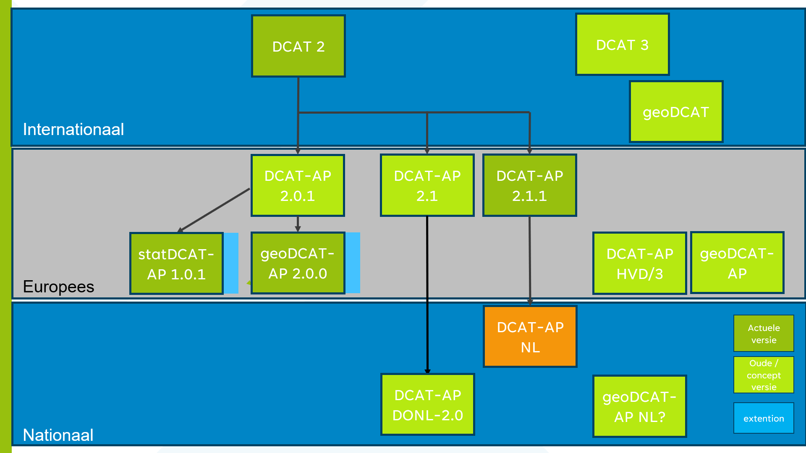

# Inleiding {#3F0B9851}
Om gestandaardiseerd metadata uit te wisselen tussen verschillende dataportalen heeft Europa het DCAT-AP [[DCAT-AP-3.0]] ontwikkeld. [[DCAT-AP-3.0]] is gebaseerd op de <a href='https://www.w3.org/TR/vocab-dcat-2/' target='_blank'>"Data Catalog Vocabulary" (DCAT)</a> -specificatie [[DCAT-3.0]], die wordt ontwikkeld door de Dataset Exchange Working Group. DCAT is een RDF-vocabulaire die ontworpen is om de interoperabiliteit tussen op het web gepubliceerde datacatalogi te vergemakkelijken. Dit profiel faciliteert de uitwisseling van metadata van verschillende domeinen tussen Nederlandse datacatalogi van (semi)overheidsorganisaties op lokaal, regionaal en landelijk nivo en tussen Nederlandse datacatalogi en EU datacatalogi, Het definieert het schema en geeft voorbeelden voor het gebruik ervan.
 
 
DCAT stelt een dataprovider in staat om datasets en dataservices in een catalogus te beschrijven met behulp van een standaardmodel en vocabulaire dat het gebruik en de aggregatie van metadata uit meerdere catalogi vergemakkelijkt. Dit kan de vindbaarheid van datasets en dataservices vergroten. Het maakt het ook mogelijk om een gedecentraliseerde benadering te hebben voor het publiceren van datacatalogi en maakt federatief zoeken naar datasets in catalogi op meerdere sites mogelijk met behulp van hetzelfde querymechanisme en dezelfde structuur.
 
 
In DCAT worden klassen en eigenschappen van andere gevestigde vocabulaires (ADMS, FOAF) hergebruikt. DCAT maakt gebruik van een bewezen set gemeenschappelijke metadata genaamd "Dublin Core", die in 2009 als ISO 15836-standaard werd gepubliceerd.
 
 
Dit document beschrijft het Nederlandse applicatieprofiel op [[DCAT-AP-3.0]]. Dit Nederlandse applicatieprofiel - DCAT-AP NL- beantwoordt de vraag over hoe [[DCAT-AP-3.0]] in de praktijk wordt toegepast Nederland.
## Uitgangspunten {#2536E4CD}
Bij het opstellen zijn van het applicatie profiel zijn volgende uitgangspunten gehanteerd: 
 
 
<b>Toepassingsbereik</b>
DCAT-AP-NL faciliteert: 
de uitwisseling van metadata tussen Nederlandse datacatalogi van (semi-) overheidsorganisatie en overige organisaties die maatschappelijke relevante data willen delen. 
de uitwisseling van metadata tussen Nederlandse datacatalogi en EU datacatalogi
de uitwisseling van metadata van primair open data, maar is hier niet toe beperkt
de specifieke Nederlandse behoeften van metadata in datacatalogi
de DCAT-AP annex for High Value Datasets [[DCAT-AP-HVD]]  (nog in ontwikkeling)
 
 
<b>Informatiemodellering</b>
DCAT-AP-NL: 
is een verdere specialisatie van [[DCAT-AP-3.0.0]]
als je voldoet aan DCAT-AP NL voldoe je ook aan [[DCAT-AP-3.0.0]]
bevat alle verplichte en aanbevolen properties [[DCAT-AP-3.0.0]], waarbij de gebruiksvoorwaarden van DCAT-AP-NL gelden 
properties uit [[DCAT-AP-3.0.0]] of [[DCAT-3.0]]   die niet voorkomen in DCAT-AP-NL zijn optioneel
introduceert geen uitbreidingen, 
als die al uitgedrukt kunnen worden in [[DCAT-AP-3.0.0]] of [[DCAT-3.0]]  ,
tenzij er een hele sterke behoefte / aanleiding toe is, en het [[DCAT-AP-3.0.0]] of [[DCAT-3.0]]   vocabulary hierin NIET voorziet
is zo generiek mogelijk van opzet en ligt zo dicht mogelijk bij [[DCAT-AP-3.0.0]]
is opgesteld in het Nederlands
## Relatie andere profielen {#01CB11A8}
Dit profiel is een verdere specificatie van het toepassingsprofiel van de Europa [[DCAT-AP-3.0]]. Hierbij zijn aanpassingen gedaan op basis van ervaring met DCAT-AP-DONL 1.1 en onderzoek en discussies in de werkgroep DCAT-AP-NL en is aansluiting gezocht bij metadata standaarden uit het geo en statististische domein. DCAT-AP-NL is compatible met [[DCAT-3.0]]   en [[DCAT-AP-3.0]] . 
 
 
</img>
 
 
<ol><li>DCAT-AP-NL positionering<i></i></li>
</ol>
 
 
Om zoveel mogelijk scenario's te ondersteunen, verplichten de originele [[DCAT-3.0]]  van het W3C en het toepassingsprofiel van de EU [[DCAT-AP-3.0]] weinig. 
Op dit moment zijn [[DCAT-3.0]] en [[DCAT-AP-3.0]] als kandidaat release versie beschikbaar. Na het vaststellen van deze standaarden zal er zal gekeken worden of het DCAT-AP-NL profiel ook bijgewerkt moet worden.
## Normatieve verwijzingen {#1D7CC3E3}
De volgende normen, standaarden en specificaties zijn toegepast in dit profiel:
 
 
[ident]
 
 
EN [<b>[</b><a href='https://docs.geostandaarden.nl/md/mdprofiel-iso19115/' target='_blank'><b>ISO19115-2005</b></a><b>]]</b> Geographic information – Metadata
<a href='https://www.iso.org/standard/26020.html' target='_blank'>https://www.iso.org/standard/26020.html</a>
 
 
[[DCAT-2.0]]  Data Catalog Vocabulary - Version 2.0 W3C Recommendation 04 February 
2020 <a href='https://www.w3.org/TR/vocab-dcat-2' target='_blank'>https://www.w3.org/TR/vocab-dcat-2</a>
 
 
[[DCAT-3.0]] Data Catalog Vocabulary – Version 3.0 W3C Editor's Draft 25 August 2023
https://www.w3.org/TR/vocab-dcat-3/
 
 
[[DCAT-AP-2.1.1]] DCAT Application Profile for data portals in Europe Version 2.1.0, <a href='https://joinup.ec.europa.eu/collection/semantic-interoperability-community-semic/solution/dcat-application-profile-data-portals-europe/release/211' target='_blank'>https://joinup.ec.europa.eu/collection/semantic-interoperability-community-semic/solution/dcat-application-profile-data-portals-europe/release/211</a>
 
 
[[DCAT-AP-3.0]] DCAT Application Profile for data portals in Europe Version 3.0 Candidate Recommendation published at 2024-02-12 https://semiceu.github.io//DCAT-AP/releases/3.0
 
 
[[DCAT-AP-HVD]] DCAT-AP High Value Datasets Candidate Recommendation published at 14 December 2023 https://semiceu.github.io/uri.semic.eu-generated/DCAT-AP/releases/2.2.0-hvd/
 
 
[[DCAT-AP-DONL]] DCAT-AP-DONL 2.0
24 november 2022 https://dataoverheid.github.io/dcat-ap-donl/
 
 
…
