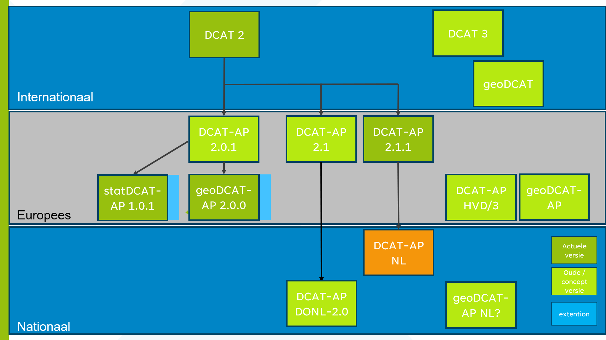
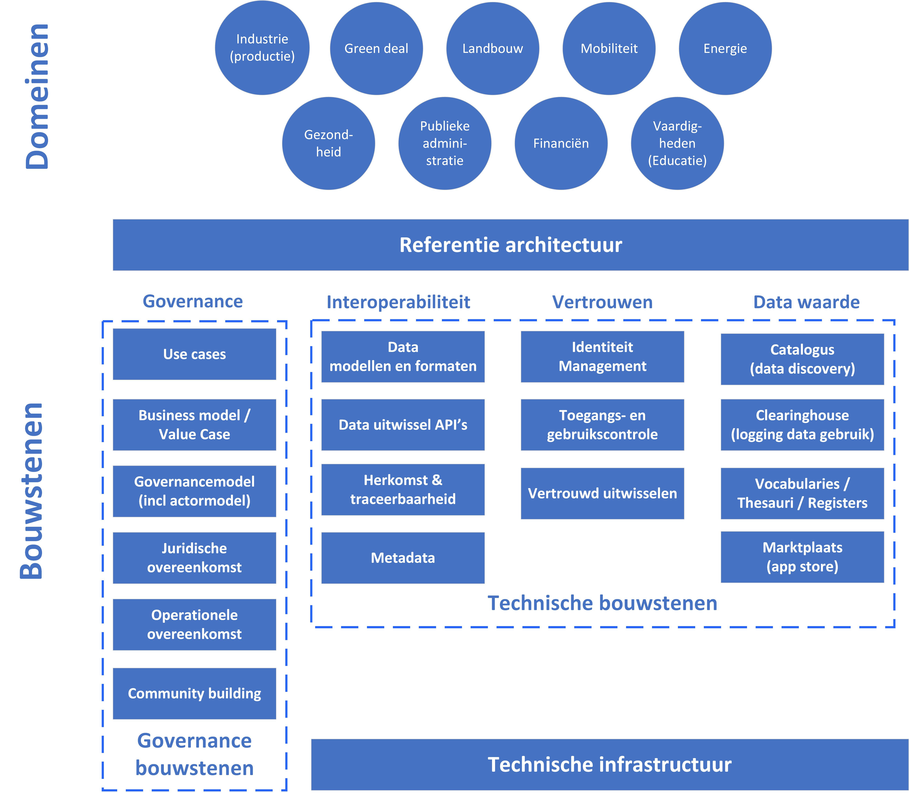

# Data spaces initiatieven beschouwd {#27A759CA}

## Inleiding {#7B937B26}

Aanleiding voor deze verkenning is de ontwikkeling van data spaces in Europa vanuit de Europese Data Strategie, die van strategisch belang zijn voor de groei van de Europese data-economie. Het doel van de Europese data strategie [[EUSD]] is om de ontwikkeling van data waarde ketens mogelijk te maken en te stimuleren, waarbij soevereiniteit en betrouwbaarheid onder Europese waarden is gewaarborgd (zie verder de <a href='https://docs.geostandaarden.nl/eu/handreiking-EU-informatie/' target='_blank'>Handreiking EU informatie m.b.t. digitale en data strategie</a>). Zoals gepresenteerd in de mededeling van de Europese Commissie van februari 2020: “<a href='https://eur-lex.europa.eu/legal-content/EN/TXT/?qid=1593073685620&uri=CELEX%3A52020DC0066' target='_blank'>De Europese strategie voor data</a>”, is de visie om interne markten voor data te creëren, genaamd ‘common European data spaces’, waar zowel persoonlijke als niet-persoonlijke data, waaronder gevoelige bedrijfsdata [[EUSD]]:[HOI] 
<ul><li>Kan stromen binnen de EU en tussen sectoren;</li>
<li>Veilig zijn en worden behandeld volgens de EU-wetgeving en relevante normen;</li>
<li>Toegankelijk en gebruikt volgens eerlijke, praktische en duidelijke regels.</li>
</ul>

Het doel van de Europese data spaces is het mogelijk maken om data uit de hele EU, zowel uit de publieke sector als uit het bedrijfsleven, op betrouwbare wijze en tegen lagere kosten uit te wisselen, waardoor de ontwikkeling van nieuwe data-gedreven producten en diensten wordt gestimuleerd. Data spaces bestaan uit zowel de technologische bouwstenen en infrastructuur evenals uit de governance-mechanismen. Deze functies zijn meestal georganiseerd in:[HOI] 
<ol><li>Dataplatforms – ondersteuning van het delen en uitwisselen van data;</li>
<li>Data marketplaatsen – ondersteuning van data-aanbod en data-aanvraag; en</li>
<li>Datasoevereiniteit – ondersteuning van controle en governance van datastromen.</li>
</ol>

## Data space definities {#628E2F17}

Er zijn diverse synoniemen voor data spaces in omloop zijn, zoals ‘data-ecosysteem’ of enkel ‘ecosysteem’, ‘datadeelsysteem’, ‘datafederatie’ en ‘federatief datastelsel’. In deze verkenning wordt de term ‘data space’ gehanteerd mede ingegeven door de Europese Data strategie en de daaruit voorvloeiende impact voor de Nederlandse data-economie. We hebben niet de intentie een discussie te voeren over de juiste definitie van een data space, maar het gaat erom te duiden dat verschillende data space initiatieven bestaan, die ieder een bepaalde invulling geven aan het delen van data. Hieronder zijn enkele omschrijvingen van data spaces opgenomen, zoals die gevoerd worden door enkele belangrijke initiatieven.\
\
</img>
<i>Bron: [[IDS-RAM3, IDS-RAM4]]</i>\
\
“The term ‘data space’ refers to a type of data relationship between trusted partners who adhere to the same high level standards and guidelines in relation to data storage and sharing within one or many <a href='https://gaia-x.eu/who-we-are/vertical-ecosystems/' target='_blank'>Vertical Ecosystems</a>.\
\
<i>Bron: </i><a href='https://gaia-x.eu/what-is-gaia-x/' target='_blank'><i>Gaia-X</i></a>\
\
</img>
<i>Bron: [[OPENDEI-DPR]]</i>\
\
“Data Spaces is an umbrella term corresponding to any ecosystem of data models, datasets, ontologies, data sharing contracts, and specialized management services (i.e., as often provided by data centers, stores, repositories, individually or within “data lakes”), together with soft competencies around it (i.e., governance, social interactions, business processes).\
\
<i>Bron: [[Scerri]]</i>\
\
“An infrastructure that enables data transactions between different data ecosystem 
parties based on the governance framework of that data space. Data space should be 
generic enough to support the implementation of multiple use cases.\
\
<i>Bron: [[DSCC-G]]</i>\
\
Het is hier niet van belang een discussie te voeren over welke definitie de juiste is. Belangrijk is te duiden, dat data spaces gaan over vertrouwd, sovereign en veilig data delen tussen de deelnemers op federatieve, gedistribueerde wijze en op basis van gezamenlijk overeengekomen afspraken en besturing. Deze aspecten van data spaces komen in de beschrijvingen naar voren. De invulling van deze aspecten om te komen tot daadwerkelijk vertrouwd, sovereign en veilig data delen is en wordt in verschillende initiatieven verder uitgewerkt. Daarmee geven deze data space initiatieven ieder een specifieke invulling aan het delen van data.[HOI] 
## Data space initiatieven beschouwd {#1B435CA4}

Anno 2023 bestaan verschillende data space initiatieven en deze zijn vaak gericht op een specifieke sector of domein. Deze initiatieven vergemakkelijken het delen van data voor hun deelnemers, zowel voor afnemers (consumenten) als aanbieders van data (producenten) in een bepaalde toepassingsdomein of vanuit een bepaald sectorperspectief. Er zijn verschillende benaderingen voor het creëren van data spaces ontwikkeld in verschillende sectorale domeinen, waarvan de geo-informatie infrastructuur er ook één is. Data spaces in het ene toepassingsdomein kunnen verder in ontwikkeling zijn en dan in het andere domein.[HOI] 
Naast sector- of domien specifieke data space initiatieven bestaan ook enkele cross-domein initiatieven, die domein-overstijgende principes, standaarden of functionaliteiten voor data delen ontwikkelen en afspreken. Nieuwe of bestaande data space initiatieven, gericht op het creëren van een data space in een bepaald domein of sector, kunnen weer principes, concepten, funties en bouwstenen adopteren van deze domein-overstijgende initiatieven.\
\
In deze verkenning zijn de volgende data space initiatieven nader beschouwd en uiteengezet via de quick-scan analyse en bezien:[HOI] 
<ol><li>International Data Spaces (IDS);</li>
<li>Gaia-X;</li>
<li>OpenDEI;</li>
<li>Data Sharing Coalition;</li>
<li>iSHARE;</li>
<li>De Europese geo-informatie infrastructuur;</li>
<li>De Nationale geo-informatie infrastructuur.</li>
</ol>

## Opzet quick-scan analyse {#4592FE93}

Als concept wordt de data space vaak beschouwd aan de hand van de wijze waarop het data delen tot stand komt. Daarvoor wordt vaak een actorenmodel geschetst met de actoren, en rollen en hun onderlinge samenhang en interacties. En onmisbaar is ook het bouwstenenmodel, dat inzicht geeft in de governance bouwstenen en meer technische bouwstenen van de data space. Voor deze verkenning is het bouwstenenmodel van OPENDEI toegepast (<a href='#d4e786'>Figuur 3</a>).\
\
<figure></img>
<figcaption>Figuur 2.1 – Data space bouwstenen naar OPENDEI <b>[[OPENDEI-DPR]]</b></figcaption></figure>

We beschouwen een aantal ‘data space’ initiatieven, waarbij telkens een aantal elementaire aspecten en onderdelen aan de orde komen:[HOI] 
<ol><li>Domein en cross-domein typering;</li>
<li>Een overall referentie architectuur voor de data space;</li>
<li>Governance, zoals actorenmodel, afspraken(stelsel) en overeenkomsten;</li>
<li>Standaarden voor interoperabiliteit betreffende data (modellen en formaten), uitwissel API’s, herkomst en traceerbaarheid van data en metadata;</li>
<li>Voorzieningen nodig voor de vertrouwd datadelen, zoals identificatie en toegang verlenen, gebruikscontrole en vertrouwd uitwisselen (en beveiliging);</li>
<li>Data waarde bouwstenen, zoals catalogi, clearinghouse (logging data transacties), vocabulaires en een marktplaats (app store).</li>
<li>Technische infrastructuur.</li>
</ol>

Het OPENDEI model [[OPENDEI-DPR]] is toegepast in een conceptueel model (zie figuur 2.2), dat leidraad is geweest voor een quick-scan analyse waarbij verschillende data space initiatieven aan onderworpen zijn. Met dit model is de quick-scan analyse uitgevoerd naar de analogie van een eerder uitgevoerde analyse van de Data Sharing Coalition [[DSC-PP]].\
\
Van het OPENDEI model zijn de 4 vier groepen of typeringen van de data space elementaire onderdelen overgenomen: governance, interoperabiliteit, vertrouwen en data waarde. Het OPENDEI model is niet één op één overgenomen, maar uitgebreid met enkele aanvullende onderdelen, zoals use cases / value cases en community building. De groepen interoperabiliteit, vertrouwen en data waarde krijgen daarbij een technische invulling in de vorm van ‘technische bouwstenen’ die in software implementaties tot uitdrukking komen. In hoofdstuk 5 is het OPENDEI model toegelicht en verder beschouwd.\
\
Het (position paper) model van de Data Sharing Coalition [[DSC-PP]]) is gebruikt voor een soortgelijke analyse van vijf data space initiatieven. Van dit model is de domein en cross-domein typering overgenomen en de harde infrastructuur (technische infrastructuur). De ‘soft infrastructuur’ uit het position paper DSC is vervangen door het OpenDEI model. Uiteindelijk is ook het beschikbaar zijn van een referentie architectuur toegevoegd, omdat de referentie architectuur vaak overzicht en inzicht in de samenhang tussen de onderdelen van het betreffende data space initiatief.\
\
</img>
<i>Figuur 2.2 – Focus en beschouwingsgebieden data spaces van deze verkenning</i>\
\
Hieronder volgt een korte beschrijving van de elementaire aspecten of beschouwingsgebieden van de data spaces. Het vergelijken van de verschillende initiatieven wordt door het gebruik van verschillende begrippen(kaders) en onderdelen is niet altijd eenduidig en in sommige gevallen lastig te typeren. Vandaar dat we hieronder de elementaire onderdelen kort beschrijven zonder daarmee een eenduidige omschrijving te willen geven, We zullen daarbij tevens soortgelijke begrippen benoemen zoals die in de diverse initiatieven worden gehanteerd. 
### Domein en cross-domein typering {#6EADC587}

Allereerst beschouwen we de domeinen waar een data space initiatief actief is. Daarvoor zijn de negen data space domeinen, die worden onderscheiden in de Europese data strategie [[EUSD]] als uitgangspunt genomen: industrie (productie), green deal, landbouw, mobiliteit, energie, gezondheid, publieke administratie, financiën en vaardigheden (educatie). Sommige data space initiatieven richten zich op een specifiek domein, en sommige initiatieven richten zich op meerdere of op alle domeinen en zijn daarmee domein-overstijgend of cross-domein initiatieven. 
### Referentie architectuur {#738A58AC}

Diverse data space initiatieven hebben om te beginnen een referentie architectuur opgesteld, onder diverse noemers: “Design Principles of Data Spaces” (OPENDEI) [[OPENDEI-ARCH]], Data Sharing Canvas (Data Sharing Coalition) [[DSC-DSC]], ‘Reference Architecture Model’ (IDSA) [[IDS-RAM4]] en ‘Architecture’ (Gaia-X) [[Gaia-X-ARCH]]. De meeste van deze referentie architecturen geven een overzicht en een globale invulling van de onderdelen of bouwstenen van een data space en hoe deze bouwstenen onderling samenhangen. En worden governance bouwstenen geduid, en de data space actoren en hun functies en rollen benoemd en hun onderlinge relaties. Ook worden de interacties tussen de bouwstenen en datadeel-processen beschreven.[HOI] 
### Governance {#0B6CD62F}

De governance bouwstenen voor data spaces zorgen voor de afspraken over de besturing en de actoren, de waardebepaling, de juridische en operationele overeenkomsten en community building. Het begint met zinvolle use cases.\
\
Met de bouwsteen <b>Use cases</b> wordt een uitgewerkte use case of toepassing van de data space vanuit het oogpunt van de gebruiker bedoeld. Data space initiatieven werken doorgaans vanuit use cases aan de implementatie van de data space.\
\
Het<b> Business model</b> / <b>value case</b> is de governance bouwsteen, die zich houdt met (methoden om) de waarde te schatten van data, die door de deelnemers in de data space wordt gedeeld. Veelal gaat het daarbij om het duiden van het belang van het business case of value case en/of hoe een business model kan worden opgesteld voor de data space.\
\
Het <b>Governance model</b> geeft inzicht in de wijze waarop de data space bestuurd wordt. Vaak is daarvoor een besturingsmodel beschikbaar met entiteiten en hun belegde verantwoordelijkheden, taken en rollen. Een actormodel maakt daar veelal deel vanuit. Actoren in de data space zijn de deelnemers in de data space, zoals data eigenaren , data providers, data gebruikers ( en diverse intermediairs (brokers, auditors, etc..).\
\
De bouwsteen <b>Juridische overeenkomst</b> omvat de verordeningen, die verwijzen naar wetten of administratieve regels, uitgevaardigd door een data space entiteit (organisatie), die worden gebruikt om het gedrag van de deelnemers aan de data space te sturen of voor te schrijven. Ook wettelijke verordeningen vallen onder de juridische overeenkomsten. Data spaces houden rekening met wetgevende vereisten, zoals de privacy wetgeving (AVG), wetgeving voor electronische identificatie (eIDAS), en betalingsverkeer in Europa (PDS2).\
\
De bouwsteen<b> Operationele overeenkomst </b>beschrijft de datadiensten die door een dataprovider worden geleverd, samen met de normen waaraan de levering van de datadiensten moet voldoen. De geleverde datadiensten moeten voldoen aan gespecificeerde normen, terwijl de consument van de diensten het recht heeft om te eisen dat aan deze normen wordt voldaan. Operationale overeenkomsten zijn een soort van Service Level Agreement (SLA). Een operationele overeenkomst kan daarnaast ook op andere operationele afspraken betrekking hebben, bijvoorbeeld:[HOI] 
<ul><li>Rapportageafspraken. Rapportages die moeten worden geproduceerd als onderdeel van de werking van de data space en in overeenstemming met de onderliggende bedrijfsmodellen. Het specificeert de indicatoren, die moeten worden geregistreerd en gerapporteerd voor elke actor en transactie van de data space;</li>
<li>Factureringsafspraken. De middelen voor facturering van verleende datadiensten en transacties. In dit verband is de specificatie van het facturerings- ofheffingsschema van belang. Dit geeft aan hoe de facturering/in rekening moet worden gebracht;</li>
<li>Contracten. Ze bieden een protocol voor de uitvoering van overeenkomsten tussen twee of meer partijen (voornamelijk de producent en de consument). Als zodanig specificeren ze beleid voor datagebruik, juridische aspecten, SLA's en andere overeenkomsten op een machineleesbare en cryptografisch ondertekenbare manier.</li>
</ul>

Tenslotte is <b>Community building</b> een belangrijke bouwsteen bij de totstandkoming van een data space. Een geharmoniseerde aanpak voor het opzetten van data spaces is eigenlijk meer een coördinatie- en schaalprobleem dan een technologisch probleem. Om data spaces in te richten, die deelnemers controle geven over hun data en met elkaar samenwerken in verschillende domeinen, is naast adequate technologie proceskennis nodig om deze te benutten. Dat betekent samenwerking, coordinatie en afstemming met alle stakeholders en deelnemers in de data space om te komen tot gemeenschappelijke en gedragen afspraken. Met Community building wordt dit proces gefaciliteerd.[HOI] 
### Interoperabiliteit {#5F5E3129}

Interoperabiliteit in data spaces moet zorgen voor de afspraken over de uitwisseling van de data. Bouwstenen die behoren tot deze categorie van data ‘interoperabiliteit’ zijn: data modellen en formaten, data uitwissel API’s, herkomst en traceerbaarheid van data en metadata.\
\
De bouwsteen <b>Data modellen en formaten </b>omvat gemeenschappelijke datamodelspecificaties (of informatiemodellen) en hun syntax voor data-uitwisseling (dataformaten). In combinatie met de bouwsteen ‘Data uitwissel API’s’ zorgt dit voor de data interoperabiliteit in een data space.\
\
De bouwsteen <b>Data uitwissel API's</b> vergemakkelijkt het delen en uitwisselen van data, d.w.z. dataverstrekking en (her)gebruik tussen deelnemers aan de data space via een afgesproken Application Programming Interface (API).\
\
De bouwsteen <b>Herkomst en traceerbaarheid</b> van data gaat over het vastleggen van de herkomst en de tracering van data: het biedt de middelen om de totstandkoming van data (of een data product) vanuit het proces van dataverwerking,-verstrekking en -gebruik te beschrijven. Het biedt daarmee de basis voor een aantal belangrijke functies, van identificatie van de afstamming van data en het audit proof loggen van transacties tot het volgen van data producten in de verwerkingsketen van data spaces.\
\
De bouwsteen <b>Metadata</b> zorgt voor de beschrijving van data producten in de data space, ook wel ‘zelfbeschrijving’ [[IDS-RAM4]] of ‘Data Asset Self-Description’ [[Gaia-X-ARCH]] genoemd. De zelfbeschrijvingen omvat een brede beschrijving van de data producten en de deelnemers in de data space alsook de publicatie- en vindmechanismen voor data producten en deelnemers. Dergelijke zelfbeschrijvingen kunnen zowel domeinoverstijgend als domeinspecifiek zijn.[HOI] 
Metadata is hier als onderdeel bij interoperabiliteit toegevoegd, omdat metadata zelfbeschrijvingen ook uitgewisseld moeten worden. Ook hier speelt de uitwisseling van de zelfbeschrijvingen en het bereiken van interoperabiliteit met vindvoorzieningen in data spaces . Deze bouwsteen heeft daarmee een duidelijke relatie met de bouwsteen ‘catalogus’ in de categorie data waarde. Metadata van data producten wordt geplaatst in één of meerdere data space catalogi om data producten en deelnemers in de data space vindbaar te maken.[HOI] 
### Vertrouwen {#0086FE8F}

In de categorie ‘Vertrouwen’ treffen we ook een drietal bouwstenen aan: identiteitsmanagement, toegangs- en gebruikscontrole en vertrouwde uitwisseling. Dat wordt ook wel het ‘trust framework’ of vertrouwensraamwerk genoemd in diverse data space initiatieven [[iSHARE-S]], [[DSC-DSC]], [[Gaia-X-TF]]].\
\
Met de bouwsteen <b>Identiteit management</b> kunnen deelnemers, die in een data space actief zijn, worden geïdentificeerd en geverifieerd (ook authenticatie genoemd) . Het zorgt ervoor dat organisaties, personen, machines en andere actoren worden voorzien van erkende identiteiten en dat die identiteiten kunnen worden geverifieerd, met inbegrip van aanvullende informatieverstrekking, die door autorisatiemechanismen kunnen worden gebruikt om daarna toegangs- en gebruikscontrole mogelijk te maken.\
\
De bouwsteen <b>Toegangs- en gebruikscontrole</b> garandeert de handhaving van het beleid inzake datatoegang en -gebruik dat is gedefinieerd als onderdeel van de algemene voorwaarden, die zijn vastgesteld wanneer data producten worden gepubliceerd of waarover wordt onderhandeld tussen de data producenten en consumenten. Een data producten- en/of data provider implementeert doorgaans mechanismen voor datatoegangsbeheer om misbruik van haar data te voorkomen, terwijl controlemechanismen voor datagebruik meestal worden geïmplementeerd aan de kant van de consument om misbruik van data te voorkomen. Dit wordt ook ‘autorisatie’ genoemd. In complexe datawaardeketens worden beide mechanismen gecombineerd door ‘prosumenten’. Toegangscontrole en gebruikscontrole zijn afhankelijk van identificatie en authenticatie.\
\
De derde bouwsteen <b>Vertrouwd uitwisselen</b> vergemakkelijkt de vertrouwde data-uitwisseling tussen deelnemers en stelt de deelnemers aan een data-uitwisseling gerust dat andere deelnemers echt zijn wie ze beweren te zijn en dat ze voldoen aan de gemaakte afspraken van de data space. Dit kan enerzijds worden bereikt door organisatorische maatregelen, zoals het werken met certificering en certificaten of door geverifieerde referenties en anderzijds door eventuele technische maatregelen. 
### Data waarde {#64108887}

In de categorie data waarde wordt de waarde van de data space zichtbaar voor de deelnemers van de data space. Vier bouwstenen worden onderscheiden: een catalogus voor het vindbaar maken van dataproducten en deelnemers, een clearinghouse om transacties vast te leggen, een bibliotheek met een overzicht van de semantiek van de data(producten), en een marktplaats om vragers en aanbieders van data en data producten bij elkaar te brengen.\
\
De bouwsteen <b>Catalogus</b> bevat de publicatie- en vindmechanismen voor data producten en deelnemers aan de data space, waarbij gebruik wordt gemaakt van de algemene zelfbeschrijvingen (metadata) van data en deelnemers aan de data space. Voor de catalogus worden verschillende termen gebruikt, zoals ‘metadata discovery’ (OPENDEI) [[OPENDEI-DPR]], ‘meta data broker’ (IDS) [[IDS-MDB]] en ‘Federated Catalogue’ (Gaia-X) [[Gaia-X-ARCH]]. Daarmee heeft deze bouwsteen een duidelijk relatie met de interoperabiliteit bouwsteen ‘metadata’. Catalogi werken ook samen en bieden mogelijkheden om elkaars metadata te oogsten en uit te wisselen. Ook hierbij spelen afspraken en standaarden een belangrijke rol.\
\
De bouwsteen <b>Clearinghouse</b> vormt de basis voor vastlegging van de transacties, die de toegang tot en/of gebruik van data door verschillende gebruikers vastleggen (de loggingsfunctie). In OPENDEI heet deze bouwsteen ‘accounting van datagebruik’ [[OPENDEI-DPR]] en in IDS ‘clearing house functies’ [[IDS-CH]]. Het clearinghouse ondersteunt naast monitoring en logging belangrijke functies voor het vastleggen van clearing, betaling en facturering, inclusief transacties voor het delen van data zonder de betrokkenheid van de marktplaats.\
\
De bouwsteen <b>Vocabularies, Thesauri en Registers</b> zorgt voor de semantische samenhang en afstemming via het vastleggen van de semantiek in de data space. Hiervoor worden de verschillende begrippen afkomstig van vnl. data modellen (informatiemodellen) van de data space vastgelegd en beschikbaar gesteld via federatieve diensten. In IDS wordt deze rol de vocabulaire-provider genoemd en het platform waar gemeenschappen gedeelde vocabulaires publiceren en onderhouden, wordt de ‘vocabulary hub’ genoemd [[IDS-RAM4]]. Andere aanduidingen hiervoor zijn begrippenlijsten, conceptenbibliotheken, taxonomien, thesauri en semantische registers en ontologien. Ook hier speelt een vindvoorziening een rol.\
\
De bouwsteen <b>Marktplaats</b> omvat het online aanbieden van data producten aan de deelnemers onder gedefinieerde voorwaarden Deze bouwsteen ondersteunt de publicatie van aanbiedingen, het beheer van processen die verband houden met het maken en monitoren van slimme contracten (die de rechten en plichten voor datagebruik duidelijk beschrijven) en regelt toegang tot data producten. In IDS wordt deze bouwsteen ‘App store’ genoemd [[IDS-RAM4]]. Deze bouwsteen ondersteunt daardoor ook de uitbreiding van data spaces met meer data producten en deelnemers.[HOI] 
### Technische infrastructuur {#5140DE7A}

De in de vorige paragrafen beschreven bouwstenen in het OPENDEI model worden ook wel aangeduid met ‘zachte infrastructuur’. Met de technische infrastructuur wordt hier bedoeld de ‘harde’ infastructuur bestaande uit de hardware en bijbehorende software om interoperabiliteit, connectiviteit en overdraagbaarheid in een data space te creëren. Denk daarbij aan aspecten van data opslag, cloud en edge service providing en netwerkconnectiviteit. Data space initiatieven laten de inrichting van de infrastructuur over aan de infrastructuur providers markt en blijven daarmee onafhankelijk en kunnen leveren aan meerdere infrastructuur platforms.[HOI] 
