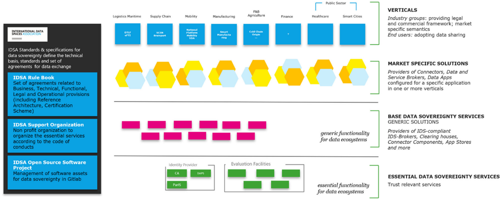
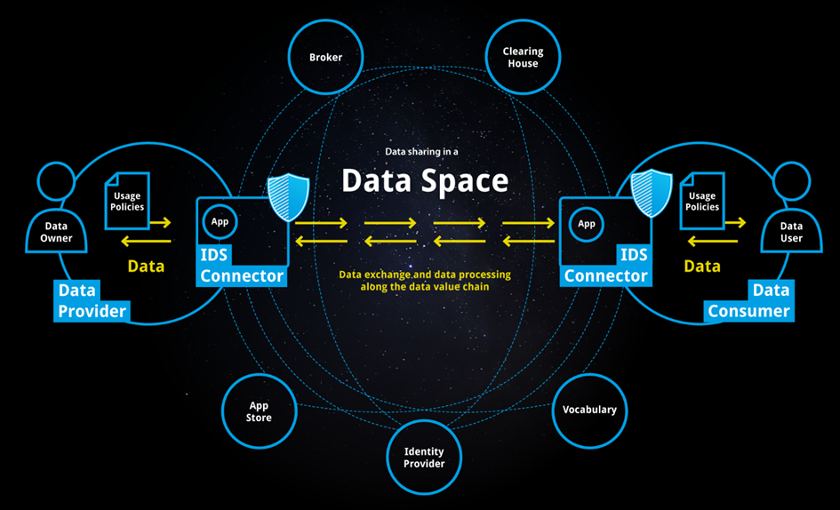
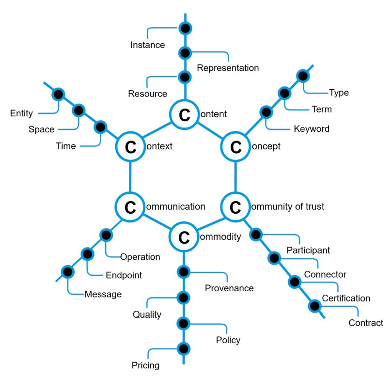
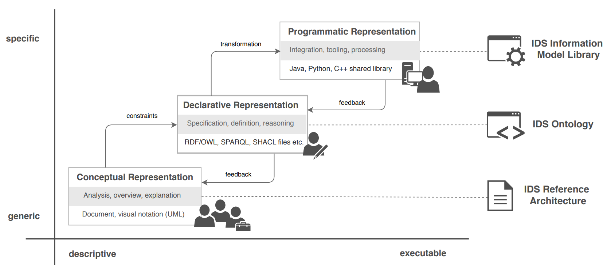
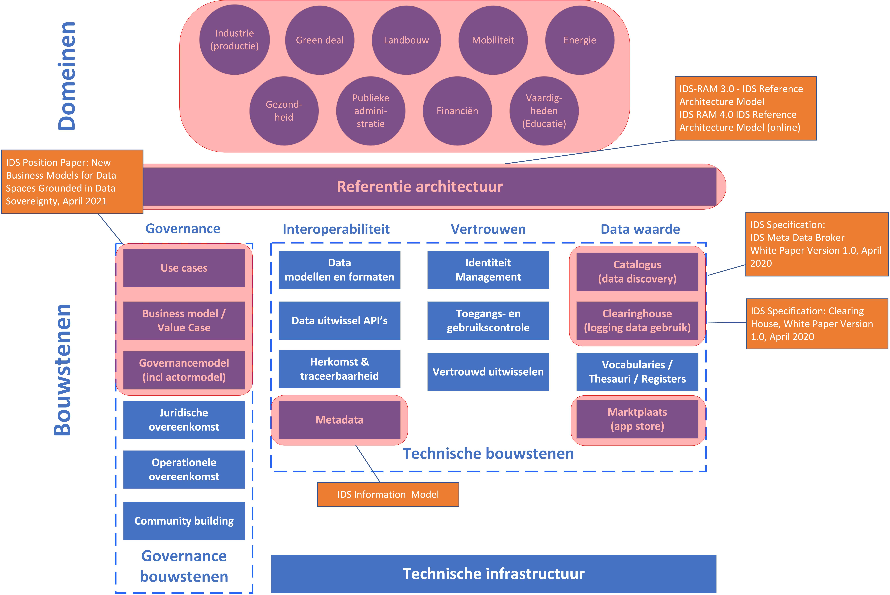

# International Data Spaces  {#26C8A0BC}

<b>Dit hoofdstuk beschrijft en introduceert het gebruik van het concept ‘data space’ vanuit het perspectief van de International Data Spaces. Naast een korte introductie beschrijven we de essentiële en ondersteunende bouwstenen van de International Data Spaces. De afspraken over het data delen komen globaal aan de orde en het actorenmodel worden kort benoemd. </b> 
## International Data Spaces  {#7D2D504E}

<a href='https://internationaldataspaces.org' target='_blank'>International Data Spaces</a> (IDS) is op een missie om de toekomst van de wereldwijde, digitale economie te creëren, een veilig, soeverein systeem voor het delen van data waarin alle deelnemers de volledige waarde van hun data kunnen realiseren. IDS maakt het mogelijk om nieuwe ‘’slimme diensten en innovatieve bedrijfsprocessen in verschillende ‘sectoren en industrieën te laten werken, terwijl ervoor wordt gezorgd dat de zelfbepaalde controle over data gebruik in handen blijft van data eigenaren (datasoevereiniteit). Aldus IDS. 

In oktober 2015 initieerde de Fraunhofer Society het International Data Spaces (IDS) project, voorheen Industrial Data Space, gefinancierd door het Duitse federale ministerie van Onderwijs en Onderzoek. IDS wordt ondersteund door de non-profitorganisatie International Data Spaces Association (IDSA), die actief bijdraagt. In 2022 bestaat de IDSA uit 138 leden van over de hele wereld, die samen de IDS-standaard voor datasoevereiniteit definiëren. De leden van de IDSA komen uit verschillende industrieën en bieden use cases waarbij de IDS-architectuur wordt toegepast in hun overeenkomstige domein.

IDS heeft daarmee mede tot doel een data-gedreven economie te creeren door de blauwdruk te bieden voor veilige, data-uitwisseling tussen partners die elkaar vertrouwen. Dit is wat wordt aangeduid met ‘dataoevereiniteit’. Data-soevereiniteit is van vitaal belang in het licht van het feit dat gegevenstoegang en -uitwisseling kritieke succesfactoren worden voor zowel bedrijven, overheid en particulieren. IDS heeft een referentie architectuur en een reeks overeenkomsten gedefinieerd die kunnen worden gebruikt om data spaces te creëren die vertrouwen tussen partners garanderen en een basis bieden voor innovatieve, nieuwe bedrijfsmodellen, data producten en diensten. 
## IDS bouwstenen voor data delen {#0999DB13}

IDSA definieert standaarden en specificaties voor datasoevereiniteit. Deze standaarden en specificaties beschrijven de technische basis, te gebruiken standaarden en afspraken nodig voor soeverein, vertrouwd en veilig data delen. In het IDS Regelboek [[IDS-PPRB]] is een overzicht opgenomen met globale activiteiten van IDS (figuur 3.1). Allereerst kent IDS organisatorisch gezien drie onderdelen.

 

</img>
<i>Figuur 3.1 – Globale overzicht van de IDS organisatie [[IDS-PPRB]]</i>

Om ervoor te zorgen dat de toekomstige data-economie soepel functioneert en zijn waardepropositie waarmaakt, moeten alle spelers zich houden aan een gemeenschappelijk governancekader dat de functionele, technische, operationele en juridische overeenkomsten specificeert die hun rollen en interacties binnen en tussen de verschillende delen van het ecosysteem structureren. Dit boek met regels en richtlijnen schetst dat kader [[IDS-PPRB]]. Door deze regels en richtlijnen te volgen, kunnen alle spelers samenwerken om het gedeelde doel te bereiken om de volledige waarde van de wereldwijde data-economie te ontsluiten. 

De IDS-ondersteuningsorganisatie is verantwoordelijk voor het bijhouden van het regelboek en voor het ondersteunen van de toepassing ervan. De IDS-ondersteuningsorganisatie helpt bij het coördineren van belangrijke processen en als algemeen bestuur een basis voor de realisatie van interne structuren en interfaces met andere partijen. 

Daarnaast bestaat het IDS Open Source project, dat de software componenten ontwikkeld voor het implementateren en testen van de essentiele IDS componenten. 

De belangrijke actoren en bouwstenen van een IDS data space zijn in onderstaande figuur 3.2 weergegeven. 

</img>
<i>Figuur 3.2 - IDS bouwstenen voor data-uitwisseling (bron: </i><a href='https://internationaldataspaces.org/wp-content/uploads/IDSA-Infographic-Data-Sharing-in-a-Data-Space.pdf' target='_blank'><i>IDS infographic</i></a><i>)</i>

De <b>data provider</b> is een ‘apparaat’, dat de data van de eigenaar overdraagt via de IDS connector naar de data space. Het stelt anderen in staat om de data te gebruiken met behoud van controle over de data: het wie, hoe, wanneer, waarom en tegen welke prijs. Dat is datasoevereiniteit, de basis voor het ontsluiten van de waarde van data. Dat wordt vastgelegd in ‘usage policies’.<b> </b>

De <b>data consument </b>is een ‘apparaat’, dat de data van de eigenaar via de IDS connector opvraagt en gebruikt in de data space. 

De <b>IDS connector</b> is een softwarecomponent waarmee de deelnemers gebruiksbeleid kunnen koppelen aan hun data in een data space, het gebruiksbeleid kunnen afdwingen en naadloos de herkomst van de data kunnen volgen. De IDS connector fungeert als gateway voor data en diensten en als vertrouwde omgeving voor Apps en software. Apps voeren taken uit zoals transacties, aggregaties of analyse van de data. 
De IDS connector is de centrale technische component voor veilige en vertrouwde data-uitwisseling. De connector verzendt data rechtstreeks naar de ontvanger in een vertrouwde, gecertificeerde data space, zodat de oorspronkelijke dataprovider altijd de controle over de data behoudt en de voorwaarden voor het gebruik ervan bepaalt. De IDS connector maakt gebruik van technologie die de data in een soort virtuele "container" plaatst, die ervoor zorgt dat deze alleen worden gebruikt zoals overeengekomen volgens de voorwaarden die door de betrokken partijen zijn vastgesteld.

IDS connectors kunnen de beschrijving van hun data producten (en eindpunten) publiceren bij een <b>broker </b>of makelaar. Hierdoor kunnen potentiële data consumenten beschikbare data producten vinden in termen van content, structuur, kwaliteit, actualiteit en andere attributen. Met hetzelfde doel, het vinden en gebruiken van de data producten, beheren vocabulaireproviders een <b>vocabulary</b>, die wordt gebruikt om data producten te annoteren en te beschrijven (inclusief ontologieën, referentie data modellen, metadata-elementen). Vocabulaireproviders leveren deze (domein-specifieke) vocabulaires en hun verwijzingen naar het IDS informatiemodel, dat de basis vormt voor de beschrijving van data producten. 

Het <b>clearing house</b> biedt indien nodig decentrale en controleerbare traceerbaarheid van alle transacties in de data space. Daarnaast biedt deze faciliteit clearing- en afwikkelingsdiensten voor alle financiële en data-uitwisselingstransacties binnen de data space. Het is de ‘verrekenkamer’.

<b>App stores</b> bieden data-apps aan. <b>Apps</b> zijn toepassingen die kunnen worden geïmplementeerd in IDS Connectors om taken zoals transformatie, aggregatie of analyse van de data uit te voeren. Data-apps kunnen worden gecertificeerd door IDS goedgekeurde certificeringsinstanties. 

De<b> identiteit providers</b> bieden een scala aan diensten voor het maken, onderhouden, beheren en valideren van identiteitsinformatie van en voor alle deelnemers. Collectief vertrouwen in de bewijsbare identiteit van alle deelnemers is noodzakelijk voor het succesvol functioneren van op IDS gebaseerde data spaces. 

## IDS referentie architectuur  {#5A7CE273}

De IDS Referentie architectuur ([[IDS-RAM3]], [[IDS-RAM4]]) beschrijft de logische samenhang van IDS als data space in vijf lagen: 
<ul><li>De businesslaag beschrijft de actoren, hun rollen en interacties. Daarbij wordt eveneens aandacht besteed aan het belang van ‘identiteiten’ vastleggen en gebruikscontracten voor het uitwisselen van data;</li>
<li>De functionele laag onderscheidt de functionele aspecten van IDS in zes categorieën: vertrouwen, veiligheid en datasoevereiniteit, het ecosysteem van data, de interoperabiliteit, value-addings apps en de data markt;</li>
<li>De proceslaag beschrijft in hoofdlijnen de belangrijke processen van IDS: het proces van ‘onboarding’ in de data space, het data-uitwisselingsproces en proces van het publiceren, gebruiken en certificeren van data apps. Voor deze processen zijn standaard procesmodellen beschikbaar;</li>
<li>De informatielaag specificeert het informatiemodel, de domeinonafhankelijke, gemeenschappelijke taal van de IDS data space;</li>
<li>Op de systeemlaag wordt aandacht besteed aan de data connector, en zijn werking in het systeem van data apps en data marktplaats. </li>
</ul>

Bij de vijf architectuurlagen worden drie perspectieven beschreven: het perspectief van de beveiliging, de certificering en de besturing (‘governance’). In onderlinge samenhang levert dit een geheel op aan componenten, processen en besturingsaspecten voor IDS. IDS is daarmee geen data space, maar een kader om data spaces in te richten. We lichten de informatielaag hieronder kort toe. 

<b>Het IDS informatiemodel</b> 
Een belangrijk onderdeel van de IDS informatielaag is het IDS informatiemodel [[IDS-IM]]. Het informatiemodel bevat alle aspecten die een rol spelen in de data space, hun definities en onderlinge relaties. Het informatiemodel ondersteunt de beschrijving, publicatie en identificatie van dataproducten en herbruikbare dataverwerkingssoftware, beiden in IDS "digital resources’ of eenvoudigweg ’resources’ of bronnen genoemd. Zodra de relevante bronnen zijn geïdentificeerd, kunnen ze worden uitgewisseld en geconsumeerd via semantisch geannoteerde, gemakkelijk vindbare diensten. 

Een belangrijk onderdeel in IDS is de uitwerking van het concept van de ‘digital resource’. Een digital resource “is a uniquely identifiable, valuable, digital (i.e. non-physical) commodity that can be traded and exchanged between remote participants using the IDS infrastructure” [[IDS-RAM3]] [[IDS-RAM4]]. Een digitale bron wordt in een data space nauwkeurig beschreven. Door een nauwkeurige beschrijving van de digitale bron worden de dataconsumenten eenduidig geïnformeerd voor doelgericht gebruik van de bron en worden misverstanden voorkomen. Dat betekent dat digitale bronnen door de dataproductleveranciers van een adequate beschrijving wordt voorzien. 

De beschrijving omvat minimaal 6 categorieën van aandacht of ’de concerns’ (zie figuur 3.3).:  
<ol><li>Content betreft de algemene beschrijving van het data product, type data product, dataformaat, datavoorbeeld en de fysieke omvang van het data product;</li>
<li>Context betreft een beschrijving van de entiteit, de locatie (zoals coördinaat referentiesysteem) en de tijdcomponent (geldigheid, creatiedatum);</li>
<li>Concept, zoals beschrijving van begrippen, sleutelwoorden en typen entiteiten uit schema’s en ontologie; </li>
<li>Communicatie, zoals wijze van ontsluiting met data uitwissel API’s; </li>
<li>Commodity of gemeengoed, zoals kwaliteitsaspecten, provenance of lineage , beleid en beprijzing van bronnen;</li>
<li>Community of Trust, dat zorgt voor en veilige en soevereine uitwisseling van digitale bronnen tussen consumenten en producten en/of leveranciers. </li>
</ol>

De digitale bron kan alleen geleverd worden na afronding van een dialoog tussen consument en dataleverancier. Denk aan: de aanvraag van de dienst door de afnemer, de wedervraag van de dienstverlener om meer informatie en het antwoord daarop. Deze dialoog stelt voorwaarden aan de afnemer. De afnemer moet de beschrijving van deze dialoog begrijpen, wil hij aan de voorwaarden kunnen voldoen.  
</img>
<i>Figuur 3.3 – Concernsmodel voor IDS ‘resources’ [[IDS-RAM4]]</i>

<b>Van informatieconcept naar implementatie</b> 
Naast de conceptuele weergave van het informatiemodel in de IDS referentie architectuur is ook de declaratieve en programmatische weergave van belang om tot de implementatie van een digitale bron en de diverse IDS bouwstenen te komen (zie figuur 3.4). 

De conceptuele weergave of representatie van het informatiemodel biedt een overzicht op hoog niveau van de belangrijkste, grotendeels invariante concepten, zonder verplichting tot een bepaalde technologie of domein. Het richt zich op een algemeen publiek, omdat het basisinformatie biedt en een gedeeld begrip van de concepten bevordert door middel van een textueel document en een visuele notatie. Indien beschikbaar, verwijst IDS ook naar gerelateerde elementen van de declaratieve weergave en een programmatische weergave, waardoor wordt aangemoedigd om naar deze alternatieve implementaties te kijken. 

De declaratieve weergave heet ‘IDS Ontology’ en geeft een normatief beeld van het IDS informatiemodel. Het is ontwikkeld op basis van de analyse, bevindingen en vereisten van de conceptuele representatie. Op basis van <a href='http://www.w3.org/standards/semanticweb' target='_blank'>W3C Semantic Web-technologiestandaarden</a> zoals DCAT, PROV en ODRL, biedt het een formele, machinaal interpreteerbare specificatie van concepten die door de conceptuele weergave worden beoogd. Bovendien beschrijft en definieert het formeel entiteiten van de IDS om de gestructureerde metadata van deze entiteiten te kunnen delen, zoeken en beredeneren. De IDS Ontology wordt meestal gebruikt en geïnstantieerd door kennisingenieurs, ontologie-experts of informatiearchitecten. In de praktijk worden bestaande domeinvocabulaires en -normen waar mogelijk hergebruikt, waardoor acceptatie en interoperabiliteit worden bevorderd.

</img>
<i>Figuur 3.4 – Weergaven van het IDS informatiemodel </i>[[IDS-RAM4]]

Als laatste richt de programmatische weergave van het informatiemodel zich op softwareleveranciers die het informatiemodel implementeren in software. De programmatische weergave biedt de best-effort mapping van de IDS Ontology op de native structuren van een doelprogrammeertaal (bijv. Java, Python, C ++). Het stelt software ontwikkelaars in staat om eenvoudig instanties van het informatiemodel te maken die voldoen aan de IDS Ontology. IDS heeft voor de programmatische weergave al diverse technische bouwstenen beschikbaar. Deze IDS componenten, zoals een data connector of metadata broker, kunnen opnieuw gebouwd worden door bestaande bronnen als sjabloon te gebruiken, of zijn via bestaande <a href='https://github.com/International-Data-Spaces-Association/idsa/blob/main/how-to-build-data-spaces/3-Build-Components.md' target='_blank'>open source componenten</a> te (her)gebruiken. 

Een transparant certificeringsproces zorgt voor vertrouwen van deelnemers en componenten binnen de data space. IDS maakt betrouwbare data-uitwisseling mogelijk tussen gecertificeerde data-aanbieders en -ontvangers, op basis van onderling overeengekomen regels.  
## Synthese {#0EDC5E74}

IDS is in Europa een breed gedragen initiatief voor het creëren van data spaces. Het IDS-raamwerk en het IDS Reference Architecture Model [[IDS-RAM4]] vormen een integraal onderdeel van de EU Data Strategie. De rol van IDS voor de EU data strategie is beschreven in dit white paper.

IDS richt zich op standaarden en specificaties voor cross-domein data spaces. De  IDS referentie architectuur [[IDS-RAM4]] beschrijft de logische samenhang van de verschillende aspecten van een data space; van actoren en hun rollen, functionele aspecten en bouwstenen, de cruciale processen, de informatielaag met beschrijving van de digitale bronnen , tot en met de systeemlaag met data connectors. In diverse gepubliceerde documenten worden onderdelen van de referentie architectuur verder uitgewerkt. De focusgebieden van IDS zijn in figuur 3.5 weergegeven. 

Om te beginnen is IDS  een generiek cross-domein referentie model voor data spaces, zonder binding aan een bepaald toepassingsdomein. 

In diverse use cases is de werking van IDS bouwstenen beproefd. In een position paper [[IDS-PPBM]] wordt een methode aangeboden om de business model en value case van de data space vast te stellen. IDS kent geen governance model voor data spaces, de referentie architectuur heeft wel de actoren en rollen van een data space vastgelegd. Een bijbehorende governance model voor de data space wordt aan de deelnemers van de domein-specifieke data space overgelaten. Diverse <a href='https://internationaldataspaces.org/make/use-cases-overview/' target='_blank'>use cases</a> illustreren het gebruik van IDS. 

</img>
<i>Figuur 3.5 - Focusgebieden IDS als data space initiatief</i>

Wat betreft de interoperabiliteit biedt het IDS informatiemodel geen meta-model voor het definiëren van data of uitwissel API’s. De domeinmodellering is doorgaans gebaseerd op gedeelde vocabulaires en schema's, zoals bijvoorbeeld verstrekt door domein-specifieke gemeenschappen. Dat is aan de domein-specifieke gemeenschappen gelaten en is geen onderdeel van IDS. Interoperabiliteit is uitgewerkt in de vorm van de metadata en de data connector. Ook is geen of nauwelijks aandacht besteed aan herkomst en traceerbaarheid, anders dan dat de beschrijving van de digitale bronnen ook de herkomst meegenomen moet worden. Daarmee is herkomst onderdeel van het informatiemodel.  

Voor het aspect vertrouwen heeft IDS aspecten in het informatiemodel uitgewerkt. In enkele position papers wordt globaal inzicht geven in de werking van bijvoorbeeld ’usage control’ [[IDS-PPUC]] en ‘certificering [[IDS-PPCE]]. 

Voor enkele van de vier bouwstenen catalogus [[IDS-MDB]], clearinghouse [[IDS-CH]], vocabulaires en marktplaats zijn eveneens specificaties opgesteld en uitgewerkt.

Op de systeemlaag worden de rollen, die op de businesslaag zijn gespecificeerd, toegewezen aan een concrete data- en servicearchitectuur om te voldoen aan de vereisten die zijn gespecificeerd op de functionele laag; de technische kern van de IDS. Uit de vereisten die aan de functionele laag zijn geïdentificeerd, resulteren drie belangrijke technische componenten: de connector, de metadata broker [[IDS-MDB]] en de App Store. Dit zijn duidelijke IDS focusgebieden, die respectievelijk verwijzen naar bouwstenen metadata, de catalogus (metadata discovery) en de marktplaats. De connector, metadata broker en App Store worden ondersteund door extra componenten, die niet specifiek zijn voor IDS, maar wel zijn gespecificeerd door IDS [[IDS-RAM4]]:  
<ul><li>de Identity Provider (vanuit het perspectief van de beveiliging);</li>
<li>de Vocabulary Hub (zoals momenteel gedefinieerd buiten IDS); </li>
<li>de Update Repository (d.w.z. de bron voor updates van de aanwezige connectors) afhankelijk van de toegepaste connectortechnologie; </li>
<li>de Trust Repository. </li>
</ul>

Ook kent IDS open source software implementaties, die momenteel voornamelijk beschouwd worden als referentie implementaties. En zo zijn diverse implementaties voor de IDS connector beschikbaar [[IDS-DC]]. 

De <a href='https://internationaldataspaces.org/adopt/data-space-radar/' target='_blank'>IDSA Data Space Radar</a> is het platform voor het vinden van IDS data space use cases.. De radar behandelt use cases van verschillende gradaties van volwassenheid, van de fase van het maken van een business case tot ‘echte’ data spaces; van gepland tot pilot tot volledig operationeel, in verschillende sectoren en functionele domeinen.

