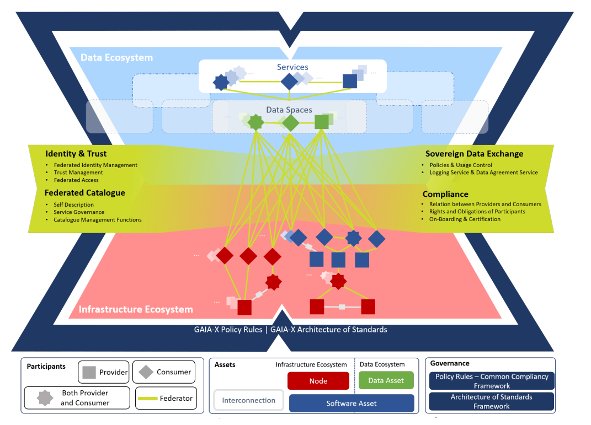
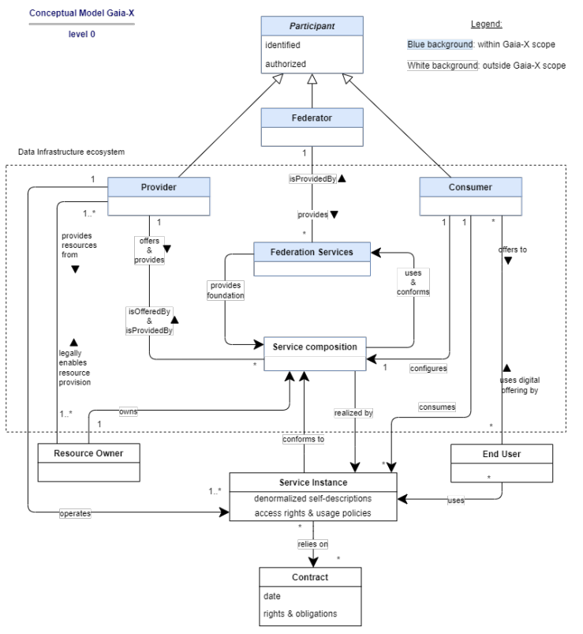
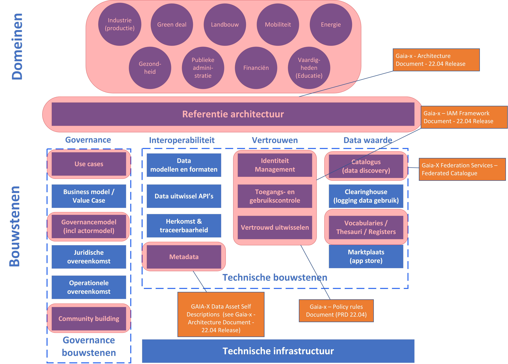

# Gaia-X {#43277259}

<b>Dit hoofdstuk introduceert het concept ‘data space’ vanuit het perspectief van de Gaia-X als ‘verbinder tussen eco-systemen’. Naast een korte introductie beschrijven we de functionele bouwstenen en onderscheiden federatieve diensten van Gaia-X. De afspraken over interoperabiliteit en standaarden voor data delen komt aan de orde en het actorenmodel worden benoemd. En we staan even stil bij de positionering van Gaia-X ten opzichte van het in het vorig hoofdstuk geïntroduceerde IDS initiatief. </b> 
## Gaia-X als verbinder tussen ecosystemen {#3BF39183}

<a href='https://www.gaia-x.eu/' target='_blank'>Gaia-X</a> is een Europees initiatief, dat een softwareraamwerk van controle en governance ontwikkelt en een gemeenschappelijke reeks van beleidsregels implementeert. Deze kunnen worden toegepast op elke bestaande cloud / edge-technologiestack om transparantie, controleerbaarheid, portabiliteit en interoperabiliteit tussen data en diensten te verkrijgen. Het raamwerk is bedoeld om te worden geïmplementeerd bovenop elk bestaand cloudplatform. Gaia-X is geen marktexploitant en zal ook geen van de door het raamwerk vereiste diensten rechtstreeks of uitsluitend exploiteren. Gaia-X-diensten zullen worden gecreëerd, geëxploiteerd en geadopteerd door markt exploitanten, die besluiten de Gaia-X-standaard te adopteren.

De naam van het project Gaia-X komt overeen met de hoge ambities, vernoemd naar de Griekse aardgodin Gaia, die één van de eerste godheden was die uit de chaos kwam. Gaia-X is bedoeld om een orde te scheppen in de digitale economie in Europa en heeft drie doelstellingen: 
<ol><li><b>Datasoevereiniteit</b>. Europese bedrijven en organisaties moeten altijd de keuze hebben waar en bij wie ze data opslaan en verwerken en waar ze digitale diensten afnemen. Gaia-X wil monopolies en daarmee een eenzijdige afhankelijkheid van Europa van grote niet-Europese platformaanbieders voorkomen. Met name kleine en middelgrote ondernemingen moeten kunnen profiteren van de transparantie van de markt, eenvoudige toegang tot diensten en aanbiedingen op maat;</li>
<li><b>Beschikbaarheid van data</b>. Wanneer data de belangrijkste grondstof worden, hebben Europese bedrijven, overheden, instellingen en burgers garanties nodig om data op een betrouwbare, veilige en transparante manier uit te wisselen. Zelfs wanneer deze data door vele handen, systemen en fasen gaan;</li>
<li><b>Innovatie</b>. Gaia-X is bedoeld om innovatie in Europa te bevorderen en de digitale economie te versterken. De cloud en edge services die onder Gaia-X zijn verzameld, ondersteunen de digitale bedrijfsmodellen van het Europese bedrijfsleven en geeft deze de mogelijkheid om op basis van deze infrastructuur wereldwijd te groeien. </li>
</ol>

Gaia-X onderschrijft als data space concept de volgende eigenschappen: 
<ul><li>Een data space is een data-integratie concept, waarbij geen fysieke integratie van data plaats heeft, maar data federatief (of gedistribueerd) wordt aangeboden;</li>
<li>Het data space concept kent geen gezamenlijk semantische data schema, maar werkt met vocabulaires;</li>
<li>Er is geen ‘single source of truth’, data kan vaker voorkomen in een data space (data kan redundant aanwezig zijn);</li>
<li>Binnen een data space kunnen weer data spaces bestaan (geneste data spaces);</li>
<li>Een data space is nooit af, en evolueert in de tijd;</li>
<li>In data spaces staat data soevereiniteit centraal; de eigenaar van data wil weten wat er met zijn data gebeurt;</li>
<li>In een data space is altijd sprake van een vertrouwensrelatie tussen aanbieder en afnemer, (via een token).</li>
</ul>

Gaia-X wordt gezien als een standaard, die data-uitwisseling mogelijk maakt in en tussen data spaces oftewel ‘Gaia-X ecosystemen’. Een Gaia-X ecosysteem is een organiserend principe, dat de interactie van verschillende actoren en hun omgeving beschrijft als een geïntegreerd geheel, zoals in een biologisch ecosysteem. In een technische context verwijst het naar een reeks losjes gekoppelde actoren, die gezamenlijk een economische gemeenschap vormen. Gaia-X maakt onderscheid in een ‘Data Ecosysteem’ en een ‘Infrastructuur Ecosysteem’, elk met een andere focus op uitgewisselde data en diensten (zie figuur 3.1).  
  
</img>
<i>Figuur 3.1 – Het Gaia-X ecosysteem </i>[[Gaia-X-ARCH]]

Ondanks dat het data en infrastructuur ecosysteem een afzonderlijke focus heeft, kunnen ze niet afzonderlijk worden bekeken omdat ze op elkaar voortbouwen en complementair zijn. Het Gaia-X ecosysteem bestaat uit het geheel van alle individuele ecosystemen die de Gaia-X architectuur gebruiken en voldoen aan de Gaia-X eisen. Er kunnen verschillende individuele ecosystemen bestaan (bijv. <a href='https://catena-x.net/en/' target='_blank'>Catena-X</a> in de automobielsector), die zichzelf orkestreren, de architectuur gebruiken en al dan niet de (open source) software van de Gaia-X federatieve diensten gebruiken.

Verder kent Gaia-X vier typen participanten: de providers, consumenten, de ‘provider en consument’ en enkele federators. De federators verschijnen als verbindingslaag tussen providers en consumenten, die de diverse federatiediensten aanbieden. Federatiediensten bieden verbindingen tussen de verschillende providers en consumenten of tussen de verschillende ecosystemen. Consumenten kunnen ook als aanbieders optreden door samengestelde diensten of verwerkte data aan te bieden via de federatieve catalogi. 

De belangrijke drie assets zijn ‘data assets’ in het data ecosysteem, de ‘nodes’ in de infrastructuur ecosysteem en de ‘software assets’ als interconnectie tussen beiden. 

Governance in Gaia-X omvat de beleidsregels, die invulling geven aan de doelstellingen, regels, praktijken of voorschriften van alle activiteiten van de deelnemers binnen het ecosysteem. Om met Gaia-X een hoger en ongekend niveau van vertrouwen in digitale platforms te garanderen, heeft Gaia-X een ‘Trust Framework’ ontwikkeld - voorheen bekend als Gaia-X Compliance and Labelling Framework - dat gegevensbescherming, transparantie, beveiliging, overdraagbaarheid en flexibiliteit voor het ecosysteem waarborgt, evenals soevereiniteit en Europese controle. Het Gaia-X vertrouwensraamwerk [[Gaia-X-TF]] is de set regels, die de minimale basis definiëren om deel uit te maken van het Gaia-X ecosysteem. Deze regels zorgen voor een gemeenschappelijk bestuur (de governance) en de basisniveaus van interoperabiliteit tussen de individuele ecosystemen. Met andere woorden, het Gaia-X ecosysteem bestaat uit deelnemers en diensten, die de Gaia-X vereisten van het vertrouwensraamwerk volgen. Het vertrouwensraamwerk maakt gebruik van verifieerbare referenties (‘credentials’) en een linked data representatie. De set berekenbare regels, die bekend staat als het nalevingsproces (‘compliance process’) is geautomatiseerd en geverifieerd.  
## Gaia-X actoren en federatieve diensten {#1900E100}

In het huidige Gaia-X architectuur [[Gaia-X-ARCH]], is het conceptueel model opgenomen met alle concepten in het kader van Gaia-X en de relaties daartussen (zie figuur 3.2). Het bovenste deel van het model toont verschillende actoren van Gaia-X, terwijl het onderste deel de relatie met actoren buiten Gaia-X toont. Het algemene interactiepatroon tussen de actoren wordt ook beschreven in [[Gaia-X-ARCH]]. Een Gaia-X participant of deelnemer kan één of meer van de volgende rollen op zich nemen: Provider, Consument of Federator. Provider en consument representeren de kernrollen, terwijl de federator hun interactie(s) mogelijk maakt. Een provider is een deelnemer die middelen of ‘resources’ exploiteert in het Gaia-X ecosysteem en deze als diensten aanbiedt. Voor een dergelijke dienst definieert de provider het dienstenaanbod inclusief algemene voorwaarden en technisch beleid meteen zelfbeschrijving (en het bijbehorende beleid). Federators zijn verantwoordelijk voor het aanbieden van federatieve diensten. Er kunnen één of meer federators per type dienst zijn.  
Een consument is een deelnemer, die datadiensten zoekt en diensten) gebruikt in het Gaia-X ecosysteem. Alle deelnemers in Gaia-X hebben een zelfbeschrijving. Dit zijn ook de belangrijke kernbegrippen in de vorm van verplichte attributen voor Gaia-X zelfbeschrijvingen, die zijn gespecificeerd in het Gaia-X Trust Framework [[Gaia-X-TF]].

</img>
<i>Figuur 3.2 – Gaia-X conceptueel model </i>[[Gaia-X-TF]]

De <b>Gaia-X Federatieve Diensten</b> [[Gaia-X-FSS]] zijn diensten, die nodig zijn voor de operationele implementatie van een Gaia-X data ecosysteem mogelijk te maken. Gaia-X onderscheidt vier groepen federatieve diensten, die nodig zijn om federatie van ‘resources’, deelnemers en interacties tussen ecosystemen mogelijk te maken. Het gaat om vier groepen federatieve diensten, gericht op identiteit en vertrouwen, compliance services voor soevereine data-uitwisseling en een federatieve catalogus waarin zelfbeschrijvingen van de deelnemende organisaties en hun diensten zijn opgenomen.

De Gaia-X gemeenschap ontwikkelt ook open-source softwarecomponenten voor de Gaia-X federatieve diensten. Deze open-source softwarecomponenten zijn beschikbaar voor iedereen en kunnen direct worden ingezet of als inspiratie dienen voor eigen ontwikkelingen. De federatieve diensten [[Gaia-X-FSS]] vertegenwoordigen de minimale technische vereisten, die nodig zijn om een Gaia-X ecosysteem op te zetten en te exploiteren. Op basis van technische specificaties worden de federatieve diensten op basis van open source code ontwikkeld. Dit staat ook bekend als de <a href='https://www.gxfs.eu/set-of-services/' target='_blank'>GXFS Toolbox</a>. Op Gitlab [[Gaia-X-G]] is de open source code van de implementatie van diverse Gaia-X federatieve diensten te vinden. 

## Synthese {#23BB2CD8}

    Gaia-X is een Europees data space initiatief. Gaia-X richt zich op standaarden en specificaties voor cross-domein data spaces. Gaia-X kent een referentie architectuur [[Gaia-X-ARCH]], die de logische samenhang beschrijft van de verschillende concepten van een Gaia-X data space; van actoren en hun rollen, de functionele aspecten en bouwstenen in de vorm van federatieve diensten , de definitie van de zelfbeschrijving van bronnen en het vertrouwensraamwerk met ‘trust anchors’, ‘policy rules’ en ‘labels. In diverse gepubliceerde documenten worden onderdelen van de referentie architectuur verder uitgewerkt. De focusgebieden van Gaia-X zijn in figuur 3.3 opgenomen. 

In diverse <a href='https://gaia-x.eu/use-cases/' target='_blank'>use cases</a> in uiteenlopende toepassingsdomeinen wordt de werking van een Gaia-X data space toegelicht. In diverse <a href='https://gaia-x.eu/who-we-are/lighthouse-projects/' target='_blank'>Gaia-X ‘lighthouse projecten’</a> wordt de werking van de Gaia-X bouwstenen inmiddels beproefd, zoals <a href='https://catena-x.net/en/' target='_blank'>Catena-X</a> voor de automobielindustrie, <a href='https://agdatahub.eu/en/' target='_blank'>Agdatahub</a> voor de agri-business en in <a href='https://mobility-dataspace.eu/' target='_blank'>Mobility Data Space</a> voor het mobiliteitsdomein. 

Gaia-X heeft een actormodel , waarin de actoren en hun rollen globaal zijn benoemd. Invulling van de actoren vindt plaats bij de implementatie van de data space. Daarnaast kent Gaia-X een governancemodel, waarin de Gaia-X een belangrijke rol speelt. Veel is er echter nog niet bekend over de wijze waarop de Gaia-X data space worden bestuurd. 

Community building is een belangrijke organisatorische pilaar van Gaia-X. Gaia-X is een gemeenschappelijk Europees project: het brengt mensen van verschillende bedrijven, onderzoeksinstellingen, verenigingen, overheden en politiek samen om te werken aan een gemeenschappelijk doel. Samen bouwen ze voort op het breedste spectrum van expertise om de toekomst van de digitale infrastructuur voor Europa te co-creëren - in speciale data spaces die de meest kritieke ‘industrieën’ bedienen. De organisatiestructuur van Gaia-X is gebouwd op drie pijlers: de Gaia-X Association, de nationale Gaia-X Hubs en de Gaia-X Gemeenschap. Daarbinnen zijn er verschillende werkgroepen en commissies. De uitwisseling binnen, tussen en buiten deze pijlers naar andere belanghebbenden (bijv. Europese Commissie, internationale initiatieven) wordt gewaarborgd. 

</img>
<i>Figuur 3.3 - Focusgebieden Gaia-X als data space initiatief</i>

Wat betreft de interoperabiliteit biedt het Gaia-X geen meta-model voor het definiëren van data of uitwissel API’s. De domeinmodellering is doorgaans gebaseerd op gedeelde vocabulaires en schema's, zoals bijvoorbeeld verstrekt door domeinspecifieke gemeenschappen. Dat is aan de domeinspecifieke gemeenschappen gelaten en is geen onderdeel van Gaia-X. Interoperabiliteit is uitgewerkt in de vorm van de zelfbeschrijving (metadata)van de ‘resources’. Ook is aan geen of nauwelijks aandacht besteed aan ‘provenance’ en ‘tracebility’. De zelfbeschrijving is vooral de waarborg voor de vertrouwd en soeverein uitwisselen van data en kan door domeinspecifieke data space initiatieven ook aangepast worden.

Voor het aspect vertrouwen heeft Gaia-X diverse aspecten in de architectuur uitgewerkt en zijn eveneens technische specificaties beschikbaar. De technische specificaties geven daarbij in detail inzicht in de functionele en niet-functionele aspecten van diverse benodigde componenten. Voor de bouwstenen catalogus, clearinghouse en marktplaats zijn technische specificaties voor de ‘Federation Services’ [[Gaia-X-FSS]] opgesteld en uitgewerkt zoals de ‘Federated Catalogue’ [[Gaia-X-FC]], de ‘Data Exchange Logging Service’, ‘Continous Automated Monitoring’ en de ‘Portal’. Ook zijn voor verschillende ondersteunende componenten technische specificaties opgesteld: de ‘Personal Credential Manager’, de ‘Organizational Credential Manager’ en Services API. Van een deel van de technische specificaties zijn implementaties beschikbaar. De beschikbare (open source) software componenten (referentie implementaties) zijn terug te vinden op Gitlab [[Gaia-X-G]]. 

