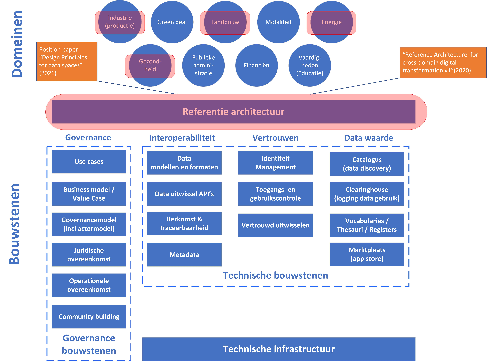

# OpenDEI {#7E82890F}\
\
## Inleiding  {#1F00F5DD}\
\
<a href='https://www.opendei.eu/' target='_blank'>OPENDEI</a> heeft tot doel lacunes op te sporen, synergiën aan te moedigen, regionale en nationale samenwerking te ondersteunen, en de communicatie tussen de EU-projecten ter uitvoering van de digitale strategie van de EU te verbeteren. Belangrijke producten van dit EU project zijn het position paper ‘Design principles for data spaces’ [[OPENDEI-DPR]] en de OpenDEI vergelijking van referentie-architecturen voor data spaces [[OPENDEI-ARCH]].  \
\
OpenDEI heeft het position paper ‘Design principles for data spaces’ opgeleverd in mei 2021 [[OPENDEI-DPR]]. Aan het OpenDEI position paper hebben diverse andere data space initiatieven en organisaties een bijdrage geleverd, zoals IDSA en Gaia-X. In het position paper beschrijft OPENDEI de principes voor het maken van data spaces en een conceptueel model van de nodige afspraken en generieke bouwstenen. OpenDEI heeft daarvoor een kader voor de ‘zachte infrastructuur’ opgezet, een soort van referentie architectuur op (functionele) hoofdlijnen. Daar waar mogelijk wordt ook gerefereerd aan toe te passen standaarden bij de invulling van bepaalde aspecten. Naast een bouwstenen model besteed OPENDEI ook aandacht aan de besturing van de data space (een governancemodel). Met een actormodel wordt een suggestie gedaan voor een governance model gebaseerd op de Europese Governance Act. Ook wordt aandacht besteed aan het belang van een business model. Het position paper onderstreept daarmee mede het belang van data spaces en het soeverein delen van data in de toekomstige EU data-economie. \
\
OPENDEI is een EU H2020 Coordination and Support Action (CSA) project, dat in de periode 2019-2022 is uitgevoerd. Het Projectconsortium, onder aanvoering van International Data Spaces Association is een samenwerking geweest met meer dan 40 data spaces initiatieven en experts uit het industriële domein, die meer dan 25 organisaties vertegenwoordigen uit 13 EU Horizon 2020 projecten en gerelateerde initiatieven. Dit heeft een eerste benadering opgeleverd van ontwerpprincipes voor data spaces en afspraken over de bouwstenen voor een ‘zachte’ infrastructuur en de governance van data spaces. In de volgende paragraaf gaan we kort in op de belangrijkste aspecten van de OpenDEI ‘design principles’.  
## OpenDEI principes en bouwstenen  {#09C5F1A5}\
\
<b>OPENDEI principes</b> 
OPENDEI hanteert vier belangrijke principes: 
<ol><li><b>Data sovereiniteit</b>. Het vermogen van een natuurlijke persoon of organisatie tot exclusieve zelfbeschikking met betrekking tot haar economische data goederen. Dit is het innovatieve en transformatieve concept dat ten grondslag ligt aan data spaces; </li>\
<li><b>Gelijk speelveld op data</b>. Nieuwkomers ondervinden geen onoverkomelijke toetredingsdrempels vanwege monopolistische situaties. Wanneer er sprake is van een gelijk speelveld voor data delen , concurreren spelers op kwaliteit van de dienstverlening en niet op de hoeveelheid data die ze beheren. Een gelijk speelveld voor data is een cruciale voorwaarde om een eerlijke economie voor het delen van data te creëren; </li>\
<li><b>Gedecentraliseerde ‘zachte infrastructuur’</b>. De infrastructuur voor het delen van data is geen monolithische gecentraliseerde IT-infrastructuur. Het is een verzameling van interoperabele implementaties van data spaces, die voldoen aan een uniforme reeks van overeenkomsten in alle dimensies: functioneel, technisch, operationeel, juridisch en economisch. Uit het principe van datasoevereiniteit volgen functionele en niet-functionele vereisten van interoperabiliteit, overdraagbaarheid, vindbaarheid, beveiliging, privacy en betrouwbaarheid;</li>\
<li><b>Publiek-private governance.</b> Voor het ontwerp, de creatie en het onderhoud van het gelijke speelveld voor data is een goede governance essentieel. Alle belanghebbenden moeten zich vertegenwoordigd en betrokken voelen. Deze omvatten gebruikers (personen, organisaties) of leverancier van datadiensten, evenals hun technologiepartners en professionals.</li>\
</ol>\
\
<b>OPENDEI bouwstenen</b> 
OPENDEI heeft een functioneel bouwstenen model voor data spaces ontwikkeld, dat veelvuldig wordt ingezet in verschillende initiatieven. In het onderstaande figuur 4.1 zijn de OPENDEI generieke bouwstenen opgenomen. Deze bouwstenen zijn ook in onderhavige studie als uitgangspunt genomen voor het bepalen van focusgebieden in verschillende data spaces initiatieven. De bouwstenen zijn uitvoerig toegelicht in paragraaf 2.4.\
\
</img>\
<i>Figuur 4.1 - OPENDEI data space bouwstenen [[OPENDEI-DPR]]</i>\
\
<b>Actormodel</b> 
De bouwstenen zullen uiteindelijk moeten worden geïmplementeerd en bestuurd worden door actoren. Daarvoor is ook een actormodel nodig (en een besturingsmodel). OPENDEI leunt wat betreft het actormodel voor het inrichten van de ‘zachte infrastructuur’ op het actormodel van IDS. OPENDEI heeft dit actormodel vereenvoudigd (zie figuur 4.2) . \
\
</img>\
<i>Figuur 4.2 – OPENDEI actormodel [[OPENDEI-DPR]]</i>\
\
OPENDEI onderscheidt vier groepen belanghebbenden in data spaces: de eigenaar van de data (‘data owner’), de dataprovider, de dataverwerker (’data processing entity’) en de marktplaats operator. Figuur 4.2 illustreert de relaties en interacties tussen deze belanghebbenden en de datastroom die tussen hen plaatsvindt.\
\
Een <b>data eigenaar</b> is een entiteit, die de bevoegdheid heeft om te beslissen hoe haar data door derden kunnen worden gebruikt. Afhankelijk van de dienst en oplossing en het bedrijfsmodel dat is opgezet, kan deze entiteit zelf data inwinnen (handmatig of met behulp van systemen) of tools en diensten van derden gebruiken om data te verkrijgen. Data kunnen on-premise, aan de rand (‘edge’) of in de cloud worden opgeslagen. Data eigenaren kunnen besluiten om hun data privé te houden voor intern gebruik (voor verbetering van eigen processen, creatie van nieuwe bedrijfswaarde voor commercieel voordeel, enz.) of deze openbaar maken of met een beperkt aantal derden delen. In het geval dat data in een of andere vorm beschikbaar worden gesteld aan derden (meestal gedaan met de hulp van een dataprovider), omvat dit rechten en plichten (beleid voor datagebruik) en algemene voorwaarden. Data eigenaren kunnen data gratis beschikbaar stellen aan derden (bijvoorbeeld om wetenschap en innovatie te bevorderen met open data) of tegen betaling aanbieden, afhankelijk van het businessmodel. \
\
Een <b>data provider</b> of <b>data leverancier</b> is een entiteit, die verantwoordelijk is voor het verzamelen en voorbewerken van data en deze namens een data eigenaar aan anderen verstrekt (vaak als onderdeel van een bedrijfsgerelateerde dienst die aan een data eigenaar wordt geleverd). Hoewel de data worden verzameld, verwerkt en opgeslagen door de data provider ten behoeve van de klant (d.w.z. de data eigenaar), blijft het latere gebruik van de data meestal onder controle van de klant. Onlangs zijn er nieuwe bedrijfsmodellen ontstaan op basis waarvan data providers hun diensten tegen gereduceerde prijzen aanbieden in ruil voor de mogelijkheid om de geanonimiseerde data van hun klant te gebruiken om bestaande diensten verder te verbeteren of nieuwe diensten te creëren die nieuwe bedrijfswaarde genereren. De data provider biedt de data eigenaar technische middelen om betrouwbare data-uitwisseling en data-uitwisseling met andere deelnemers in de data space mogelijk te maken (inclusief monitoring van datagebruik, indien gevraagd). \
\
Een <b>data verwerker</b> is een entiteit, die verantwoordelijk is voor en geïnteresseerd is in het gebruik van bepaalde soorten data om nieuwe diensten te creëren die op de markt worden aangeboden. Het spectrum van dergelijke diensten is zeer breed, variërend van domeinspecifieke use cases tot domeinoverschrijdende applicaties. De waarde van de data die worden gebruikt voor het maken van nieuwe diensten hangt af van de nauwkeurigheid van de data, de beschikbaarheid (d.w.z. het aantal data providers dat deze data aanbiedt) en hoe belangrijk deze zijn voor de gebruikte verwerkingsalgoritmen. Het wordt meestal vooraf geschat en overeengekomen, wat tot op zekere hoogte het vermogen van de dataeigenaar beperkt om maximale monetisatie van zijn data te bereiken, omdat ze geen goed begrip hebben van de extra waarde die boven op hun data wordt gecreëerd en / of de waarde die de nieuwe diensten hebben voor gebruikers. Aangezien de controle over het datagebruik is gebaseerd op conventionele contractdocumenten die door de betrokken partijen zijn opgesteld, wat leidt tot afhankelijkheid van handmatige/backoffice-activiteiten, wordt het gebruik van data verder gecompliceerd, waardoor de volledige exploitatie en monetarisering van data wordt vertraagd. \
\
Een <b>marktplaats</b> exploitant is een entiteit, die verschillende soorten infrastructuur levert (bijvoorbeeld zachte infrastructuur, hardware, tools voor dataverwerking). Bovendien is exploitant verantwoordelijk voor het beheer van de markt door ondersteunende diensten te verlenen, algemene voorwaarden te definiëren en te beslissen over toelating en intrekking van data of deelnemers. Naarmate het belang en het potentieel van data steeds meer wordt erkend, ontstaan data marktplaatsen als een nieuw type bedrijfsaanbod. Hun doel is om datagebruik op een naadloze en geautomatiseerde manier mogelijk te maken, waarbij de noodzaak van gecompliceerde backofficecontracten en -overeenkomsten wordt omzeild. Een data marktplaats kan domeinoverschrijdend of domeinspecifiek zijn.Hun belangrijkste taak is om data gemakkelijk vindbaar te maken (op basis van een reeks gestandaardiseerde datamodellen) en om transparante tracking te bieden van alle datagerelateerde transacties (van wie welke data op welk moment heeft gebruikt tot inkomsten die worden gegenereerd uit het delen van data). Exploitanten van data marktplaatsen moeten mechanismen invoeren om de naleving van het beleid inzake datagebruik te waarborgen, bijvoorbeeld met betrekking tot de tijd en het aantal data waarop de data zijn gebruikt, of toepassingsgebieden waarin bepaalde data niet kunnen worden gebruikt. \
\
<b>Governancemodel</b> 
OPENDEI heeft een aanzet gegeven voor een globaal governance model, dat gebaseerd is de <a href='https://digital-strategy.ec.europa.eu/en/policies/data-governance-act' target='_blank'>EU Data Governance Act</a>. Met deze Act stelt de EU een Data Innovation Board (DIB) in, die adviseert over de werkwijzen in het kader van deze wet, de standaarden, en interoperabiliteit (zie verder Handreiking EU informatie). Voor Europese data spaces wordt aanbevolen om voor elke data space een (domein)autoriteit voor de governance aan te wijzen en een centrale autoriteit te hebben, die toezicht houdt op alle aspecten van de data space in verband met de interoperabiliteit van data space, d.w.z. de de facto 'zachte infrastructuur'. Deze centrale autoriteit zal communiceren met alle specifieke autoriteiten voor de afzonderlijke data spaces. Voor deze governancestructuur van de zachte infrastructuur moeten overheden op drie niveaus (strategisch, tactisch en operationeel niveau) in nauwe samenhang met elkaar opereren. De EU DGA specificeert de European Data Innovation Board (DIP) als de autoriteit op strategisch niveau. OPENDEI heeft in hoofdstuk 4 van het position paper voorgesteld om eveneens een autoriteit op tactisch en operationeel niveau aan te stellen, de 'Data Exchange Board' (DEB). In de onderstaande figuur 4.3 is deze governancestructuur weergegeven.\
\
</img>\
<i>Figuur 4.3 OPENDEI Governance structuur voor de zachte infrastructuur [[OPENDEI-DPR]]</i>\
\
OPENDEI onderschrijft dit en doet de suggestie om naast de DIB een Data Exchange Board (DEB) in te richten. De DEB zal volgens OPENDEI twee hoofdactiviteiten kennen: 1. het verzorgen van het autorisatiekader en 2. het behandelen van alles met betrekking tot Europese data spaces die live en geadopteerd worden (d.w.z. implementatie, ondersteuning, communicatie). De DEB zelf zal een tweeledige structuur hebben. Een centrale rol zal worden gegeven aan de 'Raad van Deelnemers’. Deze raad zou kunnen bestaan uit vertegenwoordigers van gecertificeerde en aanblijvende partijen. De deelnemersraad krijgt het recht om de leden van de Raad van Commissarissen (samen met de DIB) te benoemen. De DEB krijgt eigen personeel. Een deel van dit personeel moet bestaan uit vertegenwoordigers van de bestuursorganisaties van de afzonderlijke data spaces. De organisatie verantwoordelijke voor de governance van elke data space zal een deel van de vertegenwoordigers aanwijzen om de DEB te bemensen. Bovendien kunnen de deelnemers van elke data space vertegenwoordigers sturen naar de Raad van Toezicht, de Raad van Deelnemers en de Change Advisory Board. De organisatiestructuur van de governance-entiteiten van de afzonderlijke data spaces moet vergelijkbaar zijn met deze algemene governancestructuur. OPENDEI adviseert daarmee ook om een strategisch, een tactisch en een operationeel niveau te definiëren voor het bestuur van de afzonderlijke data spaces, waarbij elk niveau wordt gecontroleerd door organisatorische organen die bestaan uit vertegenwoordigers van deelnemende organisaties.\
\
<b>Data space domeinen</b> 
OPENDEI heeft tevens voor vier data space domeinen verkent welke specifieke aspecten in deze data spelen van belang zijn. Het gaat om de domein industrie, energie, gezondheid en agri-voedsel. \
\
Naast bovengenoemde onderwerpen, is OPENDEI is actief geweest op verschillende fronten: 
<ul><li><b>Platformontwikkeling</b>. OPENDEI heeft een vergelijking van referentiearchitecturen [[OPENDEI-ARCH]] voor data spaces uitgevoerd, waardoor een uniform industrieel dataplatform mogelijk wordt; </li>\
<li><b>Bouwen van data-ecosystemen</b>. Een innovatie- en samenwerkingsplatform mogelijk maken, een Europees netwerk van DIH's smeden, bijdragen aan de catalogus van industriële vaardigheden en waarnemingspost; </li>\
<li><b>Grootschalige data space pilots </b>voor industrie, <a href='https://www.opendei.eu/wp-content/uploads/2022/10/OPEN-DEI-Energy-Data-Spaces-EHM-v1.07.pdf' target='_blank'>energie</a>, gezondheid en <a href='https://www.opendei.eu/wp-content/uploads/2020/09/CommonEuropeanAgriculturalDataSpace_WorkshopReportpdf.pdf' target='_blank'>agri-voedsel</a>. Bijdragen aan een digitaal volwassenheidsmodel, het creëren van een reeks beoordelingsmethoden en een benchmarkingtool voor migratietrajecten.</li>\
</ul>\
\
## Synthese {#46E617E3}\
\
OPENDEI heeft als EU project zich gericht zich op de ondersteuning van data spaces in vier domeinen: industrie (productie), energie, gezondheid, landbouw (agri-food). OpenDEI heeft voor deze domeinen aanwezige referentie-architecturen in beeld gebracht [[OPENDEI-ARCH]]. In het position paper ‘Design principles for data spaces’ [[OPENDEI-DPR]] heeft OPENDEI inzicht gegeven in functionele bouwstenen voor data spaces. De bouwstenen zijn globaal en functioneel beschreven naar governance, interoperabiliteit, vertrouwen en data waarde. Een gedetailleerde uitwerking van deze bouwstenen is niet gegeven. Enkel de uitwerking van het maken van business model en value cases voor de domeinen alsook het aanzet voor het maken van een governance model en actorenmodel worden als focusgebied benoemd. \
\
Vandaar dat deze elementen als focusgebieden in de onderstaande figuur 4.4) zijn uitgelicht. \
\
</img>\
<i>Figuur 4.4 – Focusgebieden van OPENDEI</i>\
\
