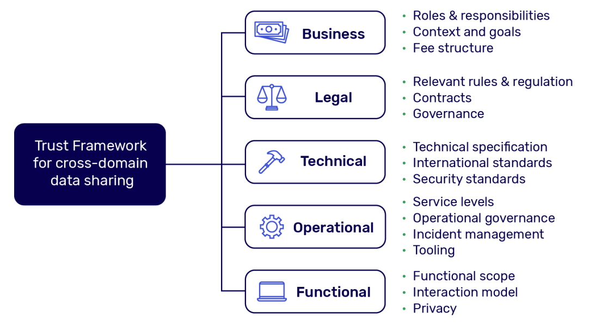
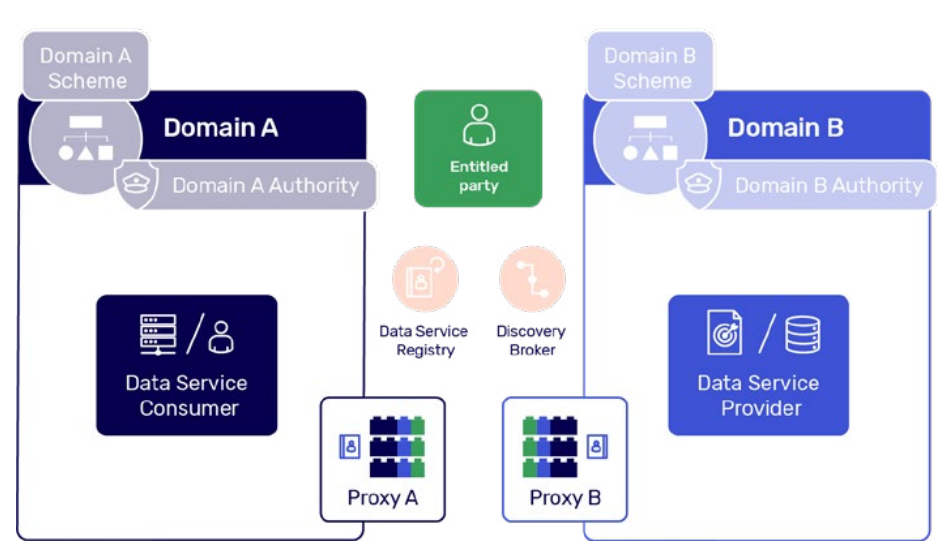
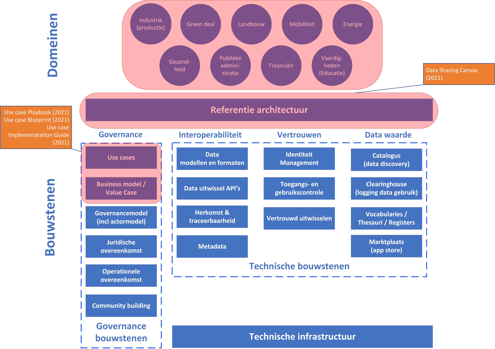

# Data sharing coalition {#0055488C}

## Inleiding {#4B775170}

De verschillende initiatieven voor het delen van data zijn vaak gericht op een specifieke sector of toepasssingsdomein. De <a href='http://www.datasharingcoalition.eu/' target='_blank'>Data Sharing Coalition</a> wil voortbouwen op bestaande initiatieven voor het delen van data om ze te versterken in en over hun domein heen. De Data Sharing Coalition heeft zich tot doel gesteld het cross-domein data delen onder controle van de rechthebbende partij te stimuleren, door interoperabiliteit tussen domeinen mogelijk te maken. De Data Sharing Coalition is een internationaal initiatief waarin een grote verscheidenheid aan organisaties samenwerkt om het data delen tussen bestaande data spaces mogelijk te maken. Door interoperabiliteit mogelijk te maken tussen bestaande en toekomstige data spaces met datasoevereiniteit als kernprincipe, kunnen partijen uit verschillende sectoren en domeinen eenvoudig data met elkaar delen, waardoor aanzienlijke economische en maatschappelijke waarde wordt ontsloten. De Data Sharing Coalition realiseert daarvoor verschillende cross-domein <a href='https://datasharingcoalition.eu/nl/use-cases-2/' target='_blank'>use cases</a>. In deze use cases definiëren en realiseren organisaties uit verschillende domeinen samen een use case die nieuwe waarde realiseert dankzij (cross-sectoraal) data delen. 

De coalitie is in januari 2020 gestart met steun van het Ministerie van Economische Zaken en Klimaat in Nederland. De verwachte levensduur van de projectfase van de coalitie is tot 2025. Tegen 2025 zal de Data Sharing Coalition naar verwachting haar resultaten en activiteiten hebben overgedragen aan een entiteit, die een Trust Framework exploiteert en beheert dat cross-domein data delen faciliteert. De eerste fase van de Data Sharing Coalition is een onderzoek naar het harmonisatiepotentieel om domeinoverstijgend data delen mogelijk te maken. Dat is uiteengezet in de Data Sharing Canvas, waarin de onderdelen van het cross-domein data delen zijn benoemd.  
## Data sharing canvas {#31FC3B52}

De Data Sharing Coalition heeft momenteel twee duidelijke focusgebieden: de ontwikkeling van het Data Sharing Canvas als een soort van referentie architectuur voor het delen van data en de onderbouwing daarvan met de inzichten en ervaringen uit use cases. 

Het Data Sharing Canvas is het conceptueel model voor het realiseren van een “trust framework for cross-domain data sharing” [[DSC-DSC]]. Het Data Sharing Canvas geeft een overzicht van de onderwerpen nodig voor data delen en hun implicaties. Het Canvas heeft niet tot doel uitputtend te zijn of in detail invulling te geven aan deze onderwerpen. Het Canvas vormt ook de globale leidraad voor toekomstige werkzaamheden van de Data Sharing Coalition, maar biedt vooralsnog geen houvast voor bindende overeenkomsten of (technische) vereisten voor data delen. Daarvoor voorziet DSC een taak voor het nog te realiseren vertrouwenskader . Aan de hand van een BLOFT model wordt het DSC vertrouwenskader beschreven. Het BLOFT model is in figuur 5.1 weergegeven. 

Het Data Sharing Canvas [[DSC-DSC]] is het huidige conceptuele kader, dat input geeft aan de Blueprint [[DSC-UCBP]] en een vertrouwenskader. In de Data Sharing Canvas zijn daarvoor de principes voor data delen uiteengezet, evenals de belangrijke concepten en onderwerpen. De onderwerpen zijn globaal en conceptueel beschreven naar leidende principes, concepten (en actoren), harmonisatie via het ‘proxy model’ en de specifieke aandacht voor de volgende onderwerpen: termen en condities, Identificatie-Autorisatie-Authenticatie (IAA), wettelijke aspecten, informatiebeveiliging, data uitwisseling, operationele overeenkomsten, business modellen en besturing (‘governance’), data standaarden en metadata. Deze onderwerpen worden vnl. conceptueel toegelicht. 
</img>
<i>Figuur 5.1 – BLOFT model Data Sharing Coalition [[DSC-DSC]]</i>

Een belangrijke rol is wegggelegd voor het <b>Proxy model</b>; een concept vergelijkbaar met de IDS data connector, die het mogelijk moet maken om het data delen tussen een vrager en aanbieder van het ene domein met het andere domein te verbinden. Om interoperabiliteit tussen domeinen en toekomstige schaalbaarheid mogelijk te maken, heeft elk domein volgens DSC nl. een proxy nodig. Proxy’s zijn systemen, die door elk domein moeten worden gebruikt met de functie van vertaling tussen domeinspecifieke specificaties en gemeenschappelijke, geharmoniseerde inter-domeinspecificaties. Dit is nodig om interoperabiliteit en vertrouwen tussen domeinen te bereiken. In figuur 5.2 is het proxy concept van DSC weergegeven. Dit model geeft weer welke actoren in scope zijn van DSC: de data service provider, de data service consumer, de rechthebbende en Domein Proxies. 

</img>
<i>Figuur 5.2 Proxy als intermediar tusssen data service consumer en provider [[DSC-UCIG]]</i>

De data service provider wordt gedefinieerd als de actor, die een data service aanbiedt aan de consument . In het use case archetype, beschreven in de Use Case Implementation Guide [[DSC-UCIG]], mag de data service provider de data service alleen leveren wanneer de rechthebbende partij expliciet toestemming heeft gegeven. De data service provider definieert de data service en de bijbehorende algemene voorwaarden. 

Een data service consument wordt gedefinieerd als de actor die gebruik maakt van een data service, die wordt aangeboden door de data service provider. De consument dient kennis te nemen van de data service aangeboden door de provider en zijn algemene voorwaarden te accepteren voordat de consument de data service kan initiëren. De rechthebbende wordt gedefinieerd als de entiteit, die rechten heeft op data. De rechthebbende keurt de data service goed, waardoor de data waarop zij rechten hebben, kunnen worden gedeeld door de provider aan de consumer.

De Data Sharing Coalition biedt naast de Data Sharing Canvas een evidente methode om een data space opzetten via het maken van een use case voor data delen. Daarvoor heeft de DSC drie ondersteunende methoden ontwikkeld. Het begint met Use Case Playbook [[DSC-UCPB]], de ‘kickstarter’ voor een data space initiatief. Dit draaiboek versnelt nieuwe use cases voor het delen van data doordat het stapsgewijze aanpak biedt voor het genereren, beoordelen en realiseren van de data space (vanuit het idee of eerste initiatief). Het begeleidt de gebruiker door de verschillende stappen, zoals het vaststellen van de context en scope, de waardebepaling, complexiteit van interacties en uiteindelijke vaststelling om tot realisatie over te gaan. De focus van dit draaiboek is om een uitgebreid en gestructureerd proces te bieden om de use case voor het data delen te ontwikkelen. Het draaiboek introduceert vijf stappen van use case ontwikkeling en geeft een concrete doelstelling, aanpak en middelen voor elke stap. Voor verschillende stappen, die in chronologische volgorde worden doorlopen, worden ter ondersteuning sjablonen verstrekt. 

Als tweede stap van de use case ontwikkeling, biedt de blueprint [[DSC-UCBP]] een uitwerking van het Data Sharing Canvas in een praktische, bruikbare aanpak voor het opstarten van de ontwikkeling van een data space [[DSC-UCBP]]. De blueprint behandelt alle relevante onderwerpen en inzichten uit het Data Sharing Canvas en biedt een goede startpositie voor het realiseren van een data space. Daarvoor wordt in drie fasen inzichtelijk gemaakt welke ontwerpkeuzes gemaakt worden voor de relevante onderwerpen: 
<ol><li>Reikwijdte en ambitie. Waarom wilt u het delen van data mogelijk maken en hoe profiteert u hiervan? Relevante onderwerpen om te bespreken zijn: context en doel, leidende principes en functionele scoping; </li>
<li>Ontwikkel de overeenkomsten die nodig zijn om de benodigde functionaliteiten mogelijk te maken. Relevante onderwerpen om te bespreken zijn: Zakelijke onderwerpen (bijv. tariefstructuren), juridische onderwerpen (bijv. governance), operationele onderwerpen (bijv. risicobeheer), functionele onderwerpen (bijv. gebruikerservaring) en technische onderwerpen (bijv. technische specificaties);</li>
<li>Bepaal de vereiste functionaliteiten om uw use case mogelijk te maken. De relevante onderwerpen om te bespreken zijn: rollen en verantwoordelijkheden, functionele componenten en het interactiemodel.</li>
</ol>

Tenslotte, geeft de Use Case Implementation Guide [[DSC-UCIG]] de laatste zet.   
Het zal domeinen informeren, inspireren en versnellen in het delen van data en hen ondersteunen bij het opzetten van activiteiten voor het delen van data. 

De Implementation Guide is gebaseerd op open standaarden en afgestemd op bestaande standaarden en implementaties voor het delen van data. Daartoe geeft de Implementation Guide een overzicht en uitleg over hoe principes van het International Data Spaces (zie hoofdstuk 3) en het vertrouwenskader iSHARE (zie hoofdstuk 7) kunnen worden toegepast voor de implementatie van een data space. Daarvoor zijn in de UCIG concepten van actoren en rollen geleend van IDS en voor het vertrouwd uitwisselen van data zijn bijvoorbeeld elementen geleend van iSHARE, zoals machine-to-machine authenticatie . Om zich voor te bereiden op toekomstige interoperabiliteit zijn de eisen in de UCIG zoveel mogelijk gebaseerd op de iSHARE-implementatie en -infrastructuur, waarbij wordt afgestemd op de specifieke context van de UCIG. iSHARE wordt geintroduceerd toegelicht in hoofdstuk 7.  
## Synthese {#11E4D3AE}

Het Data Sharing Coalition initiatief is Nederlands initiatief met een internationale focus. DSC richt zich op cross-domein data delen. DSC heeft voor cross-domein data delen een referentie architectuur ontwikkeld, genaamd het Data Sharing Canvas. Het Data Sharing Canvas is een belangrijk focusgebied van DSC en geeft globaal inzicht in de belangrijke onderwerpen voor data delen. Dit zijn de onderwerpen die nader uitgewerkt gaan worden in het aangekondigde DSC vertrouwenskader. Een gedetailleerde uitwerking van deze bouwstenen om implementatie van de bouwstenen mogelijk te maken is nog niet voorhanden. DSC heeft daarentegen veel aandacht besteed aan de implementatie van use cases en value cases. De Blueprint helpt organisaties om de Data Sharing Canvas toe te passen voor opzetten van een use case voor data delen. De uitwerking van DSC richting implementatie komt terug in de Use Case Implementation Guide. De Implementatie Guide maakt gebruik van het actormodel van IDS en de implementatieconcepten van iSHARE als vertrouwenskader. De ontwikkeling van use cases en de value case kan gerust als focusgebied van DSC worden benoemd. Vandaar dat deze elementen als focusgebieden in de onderstaande figuur 5.3) zijn uitgelicht. 

</img>
<i>Figuur 5.3 – Focusgebieden van Data Sharing Coalition</i>

Tenslotte heeft de Data Sharing Coalition een position paper ontwikkeld [[DSC-PP]], waarin de samenwerking en relatie van DSC met de andere data space initiatieven is geschetst. Dit position paper is mede leidraad geweest voor de analyse uitgevoerd in onderhavige verkenning. 

