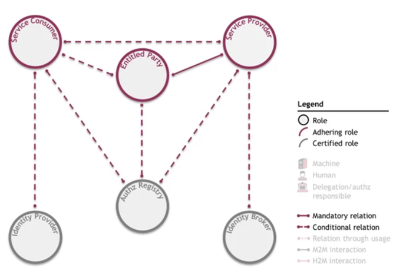
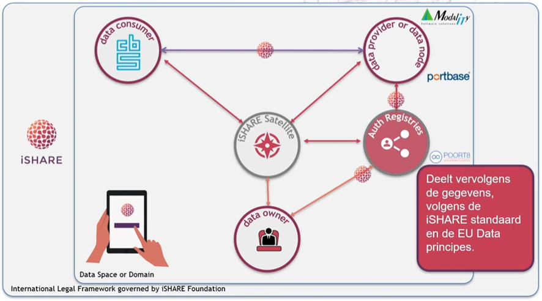
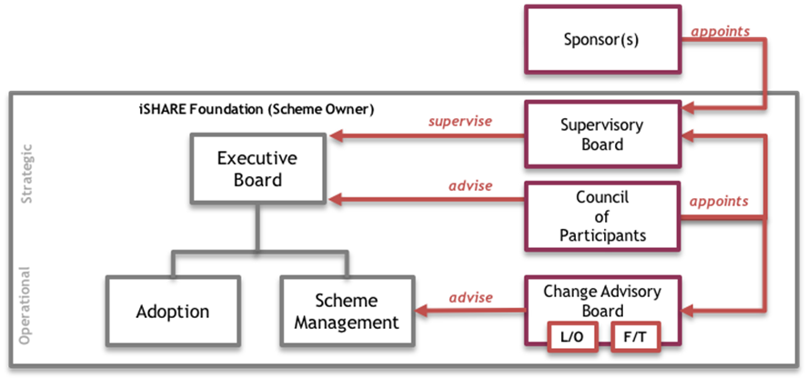
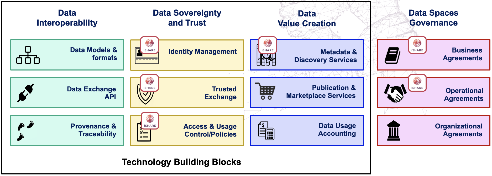
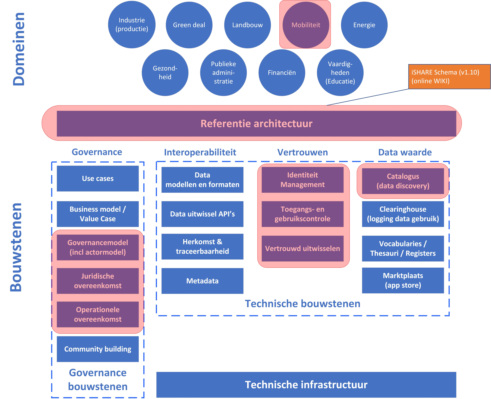

# iSHARE {#3086B37B}

## Inleiding  {#3AA0409D}

<a href='https://ishare.eu/' target='_blank'>iSHARE</a> is een Nederlands initiatief dat werkt aan een vertrouwenskader voor data spaces toegepast iSHARE is ontstaan in de logistieke sector vanuit de vraag waarom organisaties weinig tot geen data met elkaar delen. Vanuit de eerste fase in 2016 is iSHARE opgebouwd met hulp van co-creatie partners. Deze partners hebben verschillende achtergronden: de private en publieke sector, organisaties van verschillende grootte, verschillende modaliteiten, zowel aanbieders als gebruikers van data. Deze verscheidenheid aan organisaties zorgt ervoor, dat het iSHARE vertrouwenskader breed toepasbaar is geworden.

Door gebruik te maken van het vertrouwenskader van iSHARE hebben data providers de zekerheid, dat organisaties die toegang hebben tot data diensten wettelijk onder de geheimhoudingsovereenkomst vallen en in de licentie blijven die met de data is afgegeven. En daarnaast heeft de data provider de zekerheid dat alleen data, die de data provider heeft geautoriseerd, wordt gedeeld met de afnemende partij die de data provider ook heeft geautoriseerd. iSHARE is een volledig gefedereerde structuur en juridisch kader, die vertrouwen, databescherming en datasoevereiniteit binnen data spaces mogelijk maakt. iSHARE is een concrete invulling voor vertrouwelijk data delen in een data space met gebruik van open standaarden. iSHARE biedt ook referentie implementaties voor de bijbehorende data voorzieningen. 
## iSHARE ‘trust framework’ {#537E71C2}

Het iSHARE ‘trust framework’ of vertrouwenskader is een uniforme set van afspraken voor Identificatie, Authenticatie en Autorisatie (IAA), inclusief tooling die benodigd is om dit afsprakenstelsel te implementeren. Het iSHARE kader beschrijft een actormodel met zes rollen die, afhankelijk van de situatie, met elkaar interacteren op basis van de iSHARE ‘schemaovereenkomsten’ (zie figuur 6.1) [[iSHARE-GOV]].  
</img>
<i>Figuur 6.1 – iSHARE actormodel </i>[[iSHARE-GOV]]

Elke rol heeft een bepaalde functie in het schema en draagt bepaalde verantwoordelijkheden. Elke partij, die een rol vervult in iSHARE moet iSHARE-houder of iSHARE-gecertificeerd zijn: 
<ol><li>Partijen, die een ‘aanhangende rol’ vervullen, leveren en consumeren diensten onder iSHARE. Deze partijen houden zich aan de iSHARE gebruiksvoorwaarden; </li>
<li>Partijen, die een ‘gecertificeerde rol’ vervullen leveren de faciliterende functies, waarop de ‘aanhangende partijen’ kunnen vertrouwen bij het verlenen of consumeren van diensten. Om gecertificeerd te worden, moeten deze partijen niet alleen aantonen dat ze zich aan de iSHARE-gebruiksvoorwaarden houden, maar ook voldoen aan een aantal rol-specifieke criteria. </li>
</ol>

De ‘service consumer’ of <b>consument</b> wordt vervuld door een rechtspersoon, die een data dienst gebruikt, zoals verstrekt door een ‘service provider’ of <b>dienstverlener</b>. Een consument kan worden vertegenwoordigd door een machine (zijn systeem) of een persoon, respectievelijk de ‘machine service consumer’ en de ‘human service consumer’ genoemd. De dienstverlener is een rechtspersoon, die een data dienst levert voor consumptie door een consument. 

De rol van ‘entitled party’ of <b>rechthebbende</b> wordt vervuld door een rechtspersoon, die één of meer rechten heeft op een door een dienstverlener geleverde dienst, bijvoorbeeld op data. De data eigenaar is een voorbeeld van een rechthebbende. Deze rechten, of aanspraken, zijn vastgelegd in een rechtsverhouding tussen de rechthebbende en de dienstverlener. 

De ‘identity provider’ of <b>identiteitsprovider</b> is een rechtspersoon wiens tooling personen identificeert en authentiseert (en in het bijzonder personen, die consumenten vertegenwoordigen). Een identiteitsprovider biedt identificatie-informatie voor personen en geeft inloggegevens (d.w.z. een wachtwoord of elektronische keycard) aan personen. De identiteitsprovider bewaart de informatie over autorisaties van personen, die een consument vertegenwoordigen, d.w.z. informatie die aangeeft welke personen bevoegd zijn om namens een consument te handelen. Op basis van deze informatie kan de identiteitsprovider nagaan of een persoon die een rechtspersoon vertegenwoordigt, bevoegd is om een dienst af te nemen en kan de identiteitsprovider aan de dienstverlener bevestigen of dit het geval is. Als gevolg hiervan kunnen dienstverleners de identificatie en authenticatie van personen, evenals taken met betrekking tot het beheer van autorisatie- en delegatie-informatie van personen, uitbesteden aan een identiteitsprovider (in plaats van hun eigen tooling te implementeren).

Als dienstverleners ervoor kiezen om identificatie en verificatie uit te besteden aan meer dan één identiteitsprovider, kunnen ze verbinding maken met een ‘identity broker’ of <b>identiteitsmakelaar</b> in plaats van met meerdere identiteitsproviders. Verschillende personen kunnen identificaties aanbieden via verschillende identiteitsproviders. Ook moeten dienstverleners mogelijk verbinding maken met verschillende identiteitsproviders. Om ervoor te zorgen dat dienstverleners geen relatie met elke identiteitsprovider afzonderlijk nodig hebben, is een identiteitsmakelaar geïntroduceerd. De identiteitsmakelaar is een rechtspersoon, die dienstverleners toegang biedt tot verschillende identiteitsprovider en die mensen de mogelijkheid biedt om te kiezen met welke identiteitsprovider zij zich in het gehele iSHARE afsprakenstelsel identificeren en authentiseren. 

De rol van <b>autorisatieregister</b> wordt vervuld door een rechtspersoon, die oplossingen biedt voor de aanhangende partijen voor de opslag van delegatie- en autorisatie-informatie. Een autorisatieregister beschikt over informatie over delegaties naar dienstverlenende consumenten; d.w.z. informatie die aangeeft welke delen van de rechten van een rechthebbende partij zijn gedelegeerd aan een consument. Op basis van deze informatie kan het autorisatieregister het nagaan of een machine die een rechtspersoon vertegenwoordigt, bevoegd is om een dienst af te nemen en bevestigt het autorisatieregister dit aan de dienstverlener. 

<b>Voorbeeld iSHARE vertrouwd data delen use case</b> 
Om te illustreren hoe iSHARE vertrouwd data delen mogelijk maakt met behulp van het bovenstaande actormodel is hieronder een use case voorbeeld opgenomen. Om dit mechanisme van vertrouwd data delen toSHAREGOVF]e te lichten, hanteren we het volgende iSHARE use case voorbeeld [[iSHARE-S]]: het Centraal Bureau voor de Statistiek (CBS) wil (statistische) data voor haar modaliteitsrapportage opvragen van een vertrouwde importeur van televisies (die ook deelnemers is bij de iSHARE satelliet (zie figuur 6.2).

</img>
<i>Figuur 6.2 – iSHARE use case modaliteitsrapportage CBS (bron: </i><a href='https://www.youtube.com/watch?v=J9wfj3n1tIk' target='_blank'><i>iSHARE youtube presentatie</i></a><i>)</i>

 De volgende stappen worden doorlopen om de data delen:  
<ol><li>Het CBS heeft data nodig van data eigenaar T (importeur van Televisies) voor haar modaliteitsrapportage en weet even niet of de data eigenaar T is aangesloten bij iSHARE en of de data beschikbaar is in het iSHARE netwerk; </li>
<li>CBS toetst in het iSHARE netwerk of de data eigenaar T is aangesloten voor de betreffende dienst (de data voor modaliteitsrapportage) en waar de data van de data provider T verkrijgbaar is. Daarvoor raadpleegt CBS de iSHARE Satelliet; </li>
<li>De iSHARE Satelliet laat aan CBS weten bij welke data provider de data van data eigenaar T te halen is. Dit is data provider ‘Modality’; </li>
<li>Het CBS vraag aan de data provider ‘Modality’ of het CBS mag beschikken over de data van data eigenaar T. Het CBS vraagt aan de betreffende data provider Modality om de data. </li>
<li>De data provider ‘Modality’ controleert eerst of het CBS een betrouwbare data consument is en Modality doorloopt daarvoor de volgende ‘toetsen’: a. Modality controleer bij de Satelliet of data consument CBS in de iSHARE netwerk zit en b. Modality controleer bij de Satelliet of data eigenaar T in de iSHARE netwerk zit;</li>
<li>Modality toetst vervolgens in het autorisatieregister van Poort8, waar de autorisaties van de data eigenaar staan, of de gevraagde data dienst van eigenaar T wel gedeeld mag worden met het data consument CBS (en welke attributen; bepaalde velden gedeeld mogen worden). </li>
<li>Indien ja, dan levert Modality als data provider de data dienst aan data consument CBS; </li>
<li>Indien het autorisatieregister geen toestemming geeft, vraagt de data provider Modality aan de data eigenaar T of het de data dienst wil leveren aan het CBS. Als de eigenaar dat wil, dan laat eigenaar T dat weten aan het autorisatieregister en wordt het register bijgewerkt onder de voorwaarden van T, zodat de data consument CBS toegang tot de data krijgt. </li>
<li>Modality levert als data provider de data aan data consument CBS. </li>
</ol>

<b>iSHARE Satellieten</b> 
De iSHARE Satelliet vormt de kern van het iSHARE-vertrouwensnetwerk, als coördinator en governancekern in een data space. Daarom wordt de iSHARE Satelliet beheerd door coördinerende organisaties binnen een data space, die deelnemers bedient en toegang geeft. De iSHARE Satelliet heeft de rol van ‘schemabeheerder’ en zorgt voor: 
<ul><li>Toelating; vertrouwde registratie van deelnemers die gevalideerd zijn;</li>
<li>Terugtrekking: permanente beëindiging van deelnemers die de grenzen hebben overschreden of waarschuwingen negeerden;</li>
<li>Waarschuwingen, opschorting en uitsluiting;</li>
<li>Wijzigingen en updates: het registreren van aanvullende gegevens aan deelnemers, zoals extra data spaces, extra gegevensvelden of nieuwe autorisatieregisters.</li>
</ul>

Binnen een iSHARE Satelliet (ook wel iSHARE Node genoemd) kunnen beheerders deelnemers registreren met:   
<ul><li>Hun unieke ID (EORI-nummers in overeenstemming met EU-identificatie) en</li>
<li>EIDAS-identificatie; </li>
<li>Een publieke sleutel (alleen voor dienstverleners en consumenten en gecertificeerde partijen); </li>
<li>Ondertekende gebruiksvoorwaarden en eventuele aanvullende voorwaarden en van KvK-documentatie om er zeker van te zijn dat het contract wettelijk is ondertekend. </li>
<li>Voor het beheer van deelnemers heeft iSHARE een webinterface op de Node of API’s beschikbaar voor geautomatiseerde registratie. </li>
</ul>

<b>Standaarden en protocollen</b> 
Aangezien iSHARE een cross-domein data space vertrouwensraamwerk is, wordt de registratie gedaan volgens de algemene voorwaarden van iSHARE in alle data spaces met iSHARE als vertrouwenskader. Organisaties, die deel uitmaken van het iSHARE netwerk, de data eigenaren, data providers en data consumenten, hebben allemaal dezelfde Non-Disclosure Agreement en gebruiksvoorwaarden ondertekend. Elke partij wordt in het registratieproces gevalideerd door de iSHARE Satelliet om een betrouwbare onboarding te garanderen. Via het federatieve autorisatieregister geven data eigenaren toestemming voor delen van gegevenskenmerken, die beschikbaar zijn bij data providers, specifiek aan geselecteerde consumenten met behulp van licenties. In dit samenwerkingsschema, op basis van technische specificaties van iSHARE, kunnen partijen data delen , onafhankelijk waar de data ook wordt opgeslagen (bij SaaS-aanbieders in het iSHARE-netwerk of bij eigen diensten) 

De technische specificaties en API-architectuur van iSHARE zijn gebaseerd op de volgende onderdelen, standaarden en protocollen: 
<ul><li>PKI en digitale certificaten; Voor de authenticatie van partijen en machines maakt iSHARE gebruik van PKI en digitale certificaten; </li>
<li>HTTP via TLS (HTTPS); iSHARE gebruikt het veelgebruikte HTTP-protocol voor zijn communicatie, inclusief TLS om de communicatie te versleutelen;</li>
<li>RESTful API’s; iSHARE gebruikt de RESTful-architectuurstijl om API's en HTTP-aanroepen te structureren; </li>
<li>JSON/JWT; Gegevens die in de iSHARE-context worden uitgewisseld, worden gestructureerd met behulp van de JSON-standaard. Waar onweerlegbaarheid vereist is, worden JSON Web Tokens (JWT) gebruikt;</li>
<li>XACML. Delegaties zijn gestructureerd volgens een JSON-poort van de XACML-standaard.</li>
</ul>

De combinatie van bovenstaande standaarden en protocollen leidt tot een zekere dynamiek tussen de rollen in het iSHARE raamwerk. In wezen verwerven consumenten een token waarmee ze toegang hebben tot bepaalde services van bepaalde dienstverleners. De rollen, die in het iSHARE raamwerkzijn gespecificeerd, zijn gebaseerd op de OAuth-standaard. Het OAuth2.0-protocol is een implementatietechnologie voor beleidsbeheer (‘policies’) met toegangstokens, gebaseerd op generieke web service aanroepen in de vorm van API's. API’s van service providers gebruiken die toegangstokens voor verificatie van consumenten. Er wordt daarbij een twee fasen benadering gevolgd, waarbij eerst een toegangstoken wordt verkregen van de dienstverlener, op basis van goedkeuring door de rechthebbende partij, waarmee vervolgens de data door de consument kan worden opgehaald bij de dienstverlener. Beleidshandhavingsmogelijkheden zijn alleen vereist voor de dienstverlener. 

Het concept van iSHARE-satellieten in combinatie met de iSHARE autorisatieregisterrol in data spaces is eveneens gebaseerd op International Data Spaces [[IDS-RAM4]] en vervolledigt de waarde propositie van volledig vertrouwen en zekerheid op juridische en technische basis van de deelnemers in data spaces. 

<b>iSHARE governance</b> 
De besturing van het iSHARE raamwerk is geregeld via een Nederlandse stichting, opgericht In 2018. Deelnemende partijen aan iSHARE kunnen door een overeenkomst aan te gaan met deze stichting toetreden tot het iSHARE netwerk en het afsprakenstelsel. Een partij die toetreedt, werkt volgens de afspraken van het stelsel. Daartoe adopteert deze partij iSHARE specificaties in haar API software en toont daarbij aan te voldoen aan de afspraken van het stelsel. Om formeel toe te treden tekent een deelnemende partij een zogenaamde ‘toetredingsovereenkomst’ met de stichting iSHARE. 

De besturing van het iSHARE scheme [[iSHARE-S]] ligt bij de iSHARE stichting en is vastgelegd in het governancemodel van iSHARE (zie figuur 6.3) [[iSHARE-GOV]]. De iSHARE satellieten benoemen de leden in de iSHARE governance entiteiten en de data spaces die iSHARE als vertrouwensraamwerk gebruiken krijgen een plaats in de iSHARE governance en hebben zo invloed op de verdere ontwikkeling en behartiging van het belang van de data spaces.

</img>
<i>Figuur 6.3 – Besturing van het iSHARE scheme </i>[[iSHARE-GOV]] 
## Synthese {#346DAB99}

Het OPENDEI bouwstenen model voor data spaces laat zien, dat data soevereiniteit en vertrouwen en de drie bijbehorende bouwstenen identiteitsmanagement, toegangs- en gebruikscontrole en vertrouwde uitwisseling een belangrijk en integraal onderdeel zijn van het data space concept. Gezamenlijk worden ze het ‘vertrouwenskader’ genoemd. iSHARE positioneert zich in deze categorie van data space bouwstenen(zie figuur 6.4). 

</img>
<i>Figuur 6.4 – Focusgebieden iSHARE in relatie tot het OPENDEI model (bron: </i><a href='https://ishare.eu/data-space-definition-api/' target='_blank'><i>iSHARE</i></a><i>)</i>

iSHARE is ontstaan in de logistiek, maar tevens toepasbaar in andere toepassingsdomeinen (figuur 6.5).  
  
</img>
<i>Figuur 6.5 – Focusgebieden van iSHARE</i>

Als referentie architectuur voor het iSHARE vertrouwensraamwerk fungeert het iSHARE Scheme [[iSHARE-S]]. In het iSHARE Scheme is o.a. het actormodel en het governancemodel voor vertrouwd data delen en opgenomen. Het belangrijkste focusgebied van iSHARE is daarmee het volledige uitgewerkte vertrouwenskader met voorbeeldimplementaties van de componenten op github. Het autorisatieregister is als catalogus (meta discovery) eveneens als focusgebied getypeerd.

<b>Afstemming vertrouwensraamwerken</b> 
Ook geeft iSHARE invulling aan de ontwikkeling van data spaces in lijn met de International Data Spaces [[IDS-RAM4]] en Gaia-X [[Gaia-X-ARCH]]. Het iSHARE vertrouwenskader biedt basiscomponenten voor data spaces en leveren deze, in overeenstemming met de ontwerp-principes van OPENDEI, maar ook in overeenstemming met de grotere oplossingsarchitecturen zoals International Data Spaces en Gaia-X. Hierbij werkt iSHARE nauw samen met de internationale gemeenschap aan datastandaarden en andere bouwstenen voor data spaces om deze data spaces in heel Europa te stimuleren. Een nadere duiding van het iSHARE initiatief als vertrouwenskader voor data spaces ten opzichte van enkele eerder besproken Europese data space initiatieven IDSA (hoofdstuk 2), GAIA-X (hoofdstuk 3) en OPENDEI (hoofdstuk 4) is uiteengezet in [[TNO]]. 

Ook het recent gelanceerde <a href='https://i4trust.org/' target='_blank'>i4Trust EU project</a> zal bijdragen aan verdere afstemming tussen het vertrouwenskader van iSHARE en enkele Europese data space initiatieven. I4Trust stimuleert met subsidies de totstandkoming van data spaces in verschillende domeinen en heeft als doel daarmee de data-economie met data spaces in Europa te versnellen. Daarbij wordt gebruik gemaakt van het iSHARE Trust framework.  
In de recente samenwerking tussen iSHARE en Gaia-X, zijn partijen overeengekomen om beide vertrouwensraamwerken te harmoniseren om ontwikkeling van data spaces te versnellen. Het doel hiervan is geharmoniseerde interfaces en vertrouwensniveaus, wat in lijn is met de samenwerkingsovereenkomst tussen iSHARE en International Data Spaces. Deze heeft als doel om op één lijn te zitten met het gezamenlijke technologie framework dat ontwikkeld wordt door de Data Spaces Business Alliance (BDVA, Gaia-X, IDSA, FIWARE). Het Identity and Access Management framework van i4Trust zal evolueren om af te stemmen met de resultaten van de recente Technology Convergence discussie onder de koepel van de Data Spaces Business Alliance [[DSBA]].

