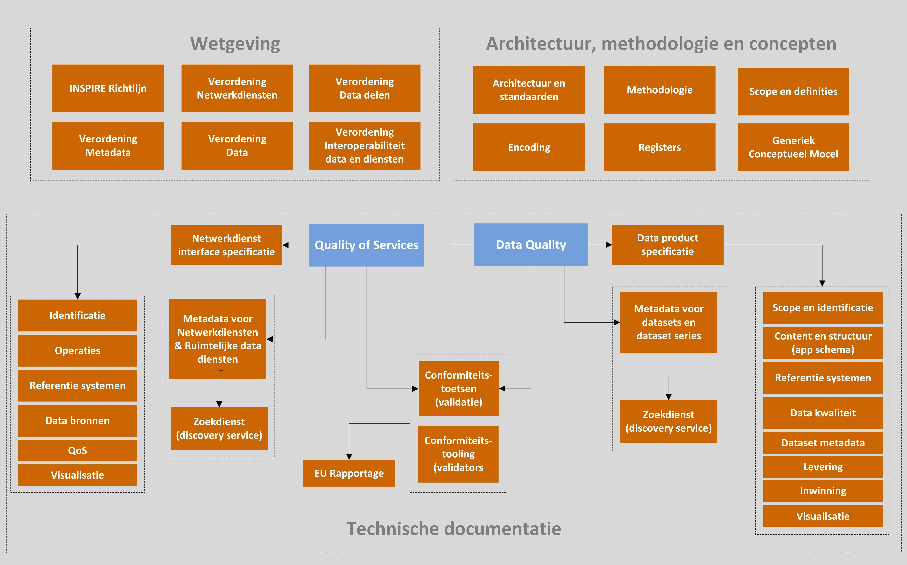
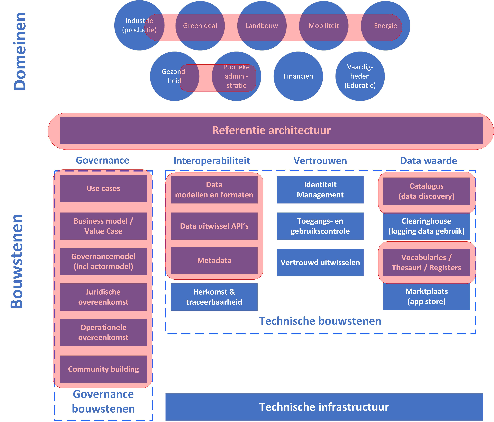

# De Europese geo-informatie infrastructuur {#0F00A6D6}

<b>Dit hoofdstuk beschrijft en introduceert de het gebruik van het concept ‘data space’ vanuit het perspectief van de Europese Geo-Informatie Infrastructuur (NGII). We belichten het ‘data fundament’, de afspraken over standaarden voor interoperabiliteit, de bouwstenen en voorzieningen in de Europese geo-informatie infrastructuur, die in de afgelopen 15 jaar is gerealiseerd op basis van de Europese INSPIRE Richtlijn. </b> 
## De Europese geo-informatie infrastructuur  {#0D00A2FA}

Een inmiddels geïmplementeerde data space in de Europese Unie is de <a href='https://inspire.ec.europa.eu/' target='_blank'>Europese geo-informatie infrastructuur</a> die tot stand is gekomen na de invoering van de Europese INSPIRE Richtijn in 2007, in Nederland bekend als de <a href='https://wetten.overheid.nl/BWBR0026158/2022-05-01' target='_blank'>INSPIRE Wet</a>. In het kader van INSPIRE zijn vanuit Nederland op gestandaardiseerde en geharmoniseerde wijze zo’n 200 nationale datasets beschikbaar gesteld aan de Europese geo-informatie infrastructuur. Deze datasets zijn vindbaar, bekijkbaar (metadata en view service) en downloadbaar (directe download en indirecte bulkdownload). De data zijn in Nederland vindbaar in het <a href='https://www.nationaalgeoregister.nl/' target='_blank'>nationaal georegister</a>, dat tevens fungeert als nationaal toegangspunt voor het <a href='https://inspire-geoportal.ec.europa.eu/' target='_blank'>EU geoportaal</a>. Het Europese geoportaal is de centrale catalogus waar alle lidstaten hun data producten (datasets en netwerkdiensten) voor de Europese geo-informatie infrastructuur kenbaar maken. 

De Europese richtlijn INSPIRE verbetert de beschikbaarheid, kwaliteit, toegang tot en uitwisseling van plaatsgebonden data of locatiedata over het milieu in Europa. Denk aan data als de locatie van administratieve grenzen, watersystemen, landbouw, industrie en vervoersnetwerken en de geografische spreiding van luchtkwaliteit en geluid, maar ook van bevolking, plant- en diersoorten en de gezondheid op een locatie. INSPIRE verplicht de publieke dataproviders in de 27 Europese lidstaten om locatiedata over 34 thema’s digitaal vindbaar, bruikbaar en uitwisselbaar te maken. De beschrijvingen van deze 34 thema’s zijn hier te vinden. Om dit mogelijk te maken worden de datasets gestandaardiseerd beschikbaar gemaakt, zodat de datasets binnen en tussen lidstaten naadloos aansluiten en eenzelfde, begrijpelijke taal spreken. Daarmee is een netwerk van data diensten op het Internet ontstaan, waarmee publieke en openbare locatiedata veel beter, uniformer en begrijpelijker toegankelijk worden voor overheid, burgers en bedrijven en de Europese data-economie. 

<b>De INSPIRE principes</b> 
INSPIRE kent een aantal uitgangspunten en principes: 
<ul><li>INSPIRE is bedoeld om op kwalitatief hoogwaardige wijze milieudata vrij beschikbaar te stellen via het Internet, zowel voor de overheid als voor burgers en bedrijven;</li>
<li>INSPIRE is een geografische informatie infrastructuur voor het delen van milieudata op basis van een omvangrijke set van standaardisatie afspraken voor geo-informatie uitwisseling;</li>
<li>De infrastructuur gedachte gaat uit van het eenmalig verzamelen en opslaan (bij de bron) en het via de locatie kunnen combineren van verschillende milieudatasets uit meerdere bronnen naar de vele gebruikers en hun toepassingen;</li>
<li>INSPIRE gaat niet over het inwinnen van milieudata. INSPIRE vraagt publieke organisaties om aanwezige data beschikbaar te stellen in een uniforme structuur. Het is ook niet noodzakelijk voor INSPIRE gegevens te verzamelen;</li>
<li>De milieudata is eenvoudig vindbaar en het is duidelijk hoe de data kan worden gebruikt ten behoeve van een bepaald gebruiksdoel en onder welke condities en gebruiksvoorwaarden de data worden beschikbaar gesteld;</li>
<li>De methode INSPIRE werkt met en op internationale open standaarden aangaande de 3 bouwstenen: 1. diensten in de vorm van web services, 2. informatiemodellen voor uniforme data en 3. metadata voor zowel de services als datasets;</li>
<li>INSPIRE is functioneel simpel en 3-ledig. De gebruiker kan milieudata 1. zoeken, 2. bekijken en 3. downloaden en aanroepen;</li>
<li>INSPIRE biedt afspraken over het beperken van de toegang tot milieudata. Voor EU instellingen zijn nog specifieke regels opgesteld.</li>
</ul>

<b>De INSPIRE functies</b> 
Voor gebruikers heeft INSPIRE een vrij overzichtelijke opzet (zie figuur 7.1) en is INSPIRE functioneel simpel gehouden met 3 functies: zoeken - bekijken – downloaden en aanroepen. Dit staat ook wel bekend als het publish-find-bind principe van service oriented architectuur. De gebruiker kan de milieudata zoeken via de zoekdienst (discovery service), zoals het nationaal georegister, het EU portaal of een eigen applicatie. De gebruiker evalueert de geschiktheid van de milieudata op basis van de eigenschappen van de dataset (metadata) en/of door het bekijken van de dataset in kaartvorm (view service). Indien de gebruiker de data geschikt acht voor haar gebruiksdoel, wordt de data gedownload voor gebruik (download service), of aangeroepen als ruimtelijke datadienst (spatial data service). De ruimtelijke datadienst maakt een meer specifieke bevraging op de dataset mogelijk (bijv. geocodering van een adres, een berekening tussen twee punten, etc.). De gebruiker krijgt toegang tot de data via zijn eigen bedrijfsapplicatie(s). De bedrijfsapplicaties moeten daarvoor wel geschikt zijn, d.w.z. de INSPIRE standaarden ondersteunen. 

</img>
<i>Figuur 7.1 – Referentie architectuur INSPIRE </i>[[JRC126319]]

Voor data providers is de architectuur complexer, met name door de data transformaties (bijv. coördinaatstelsel- en datamodeltransformaties), die uitgevoerd moeten worden om INSPIRE compliant data te leveren. Tevens zijn - naast het nationaal georegister - ook enkele generieke, ondersteunende voorzieningen beschikbaar, zoals een diverse registers (namespaces, coördinaatreferentiestelsels, begrippen, etc.) en validatietools. 

<b>INSPIRE afsprakenstelsel</b> 
INSPIRE bestaat uit een set van formele afspraken, een kwaliteitsraamwerk met diverse aspecten van data delen binnen de Europese geo-informatie infrastructuur (zie figuur 7.2). 

</img>
<i>Figuur 7.2 – Afsprakenstelsel Europese geo-informatie infrastructuur (INSPIRE)</i>

De volgende afspraken maken deel uit van het gehele kwaliteitsraamwerk: 
<ol><li>Formele afspraken over scope, te hanteren begrippen, generiek conceptueel model voor datamodellen, methodologie, technische architectuur en standaarden, en data encoding;</li>
<li>Formele afspraken over hoe data uniform beschreven moet worden tussen organisaties in verschillende lidstaten (o.a. tot in details uitgewerkte modelleer conventies voor opstellen van informatiemodellen, applicatie schema’s en uitwisselformaten), die worden toegepast t.b.v. data product specificaties voor 34 thema’s;</li>
<li>Formele afspraken over functionaliteit voor het uitwisselen van data via principes van service oriented architecturen en gestandaardiseerde service interfaces;</li>
<li>De (kwaliteits)beschrijving van datasets en services met metadata, zodat het zoeken-raadplegen-downloaden en aanroepen adagium van service georiënteerde architecturen wordt ondersteund;</li>
<li>De mogelijkheid voor conformiteitstoetsing t.b.v. EU rapportages op basis van Abstracte test Suites. </li>
<li>INSPIRE kent een aanpak met gedistribueerde verantwoordelijkheden en in combinatie enkele generieke, centrale voorzieningen, m.n. registers;</li>
<li>INSPIRE kent een aanpak van referentie architecturen, abstracte modellen en richtlijnen en uitgewerkte concrete (technische) handleidingen;</li>
<li>Deze formele afspraken zijn/worden door de stakeholders (gebruikers en data providers) zelf opgesteld. Draagvlak wordt daarmee verkregen en inhoudelijke discussies over content, modellen en standaarden beslecht;</li>
<li>Daarbij kent INSPIRE een implementatie roadmap.</li>
</ol>

## Synthese {#3D69A2FD}

De Europese geo-informatie infrastructuur is als data space tot stand gekomen als het geheel van afspraken vastgelegd in wetgevende en technische documenten. In figuur 7.3 zijn de focusgebieden weergegeven, die van belang zijn geweest bij de totstandkoming van de Europese geo-informatie infrastructuur ofwel de data space op basis van het gehele (wettelijke) INSPIRE raamwerk.  

Formele afspraken over hoe data uniform beschreven moet worden tussen organisaties in verschillende lidstaten), die worden toegepast t.b.v. data product specificaties voor 34 thema’s. Afspraken over data interoperabiliteit zijn vastgelegd in conceptuele kaders en technische uitvoeringsregels: scope, te hanteren begrippen, generiek conceptueel model voor data modellen, data formaten, methodologie voor data harmonisatie, technische architectuur en standaarden.

</img>
<i>Figuur 7.3 - Focusgebieden INSPIRE als data space initiatief</i>

INSPIRE beschrijft in technische uitvoeringsregels ook hoe de data uitwissel API’s moeten worden ingericht. Deze formele afspraken over functionaliteit voor het uitwisselen van data via principes van service oriented architecturen en gestandaardiseerde service interfaces zijn uitvoerig vastgelegd. Ook is een (kwaliteits)beschrijving van datasets en services met metadata ontwikkeld, zodat het zoeken-raadplegen-downloaden en aanroepen adagium van service georiënteerde architecturen wordt ondersteund. Daarbij is de mogelijkheid aanwezig voor conformiteitstoetsing t.b.v. EU rapportages op basis van Abstracte Test Suites. 

Om datasets vindbaar te maken kent INSPIRE een aanpak met gedistribueerde verantwoordelijkheden in combinatie enkele (de)centrale voorzieningen: metadata catalogi (vindvoorziening via <a href='https://inspire-geoportal.ec.europa.eu/' target='_blank'>EU Geoportal</a>) en zijn diverse ondersteunende <a href='https://inspire.ec.europa.eu/registry/' target='_blank'>Europese registers</a> en nationale registers opgezet (woordenboeken, vocabulaires, namespaces, identifiers, coördinaatreferentiesystemen, etc. Voor het opzetten van registers is <a href='https://joinup.ec.europa.eu/collection/are3na/solution/re3gistry' target='_blank'>Re3gistry software</a> ontwikkeld. 

Daarbij ging de invoering van INSPIRE gepaard met een implementatie roadmap en governance structuur. De afspraken zijn door de stakeholders in de EU opgesteld. Draagvlak wordt daarmee verkregen en inhoudelijke discussies over content, modellen en standaarden beslecht (use cases, business models en community building). De implementatie is overgelaten aan de lidstaten en publieke organisaties in de lidstaten. 

INSPIRE stelt geen eisen aan identiteit management, toegangs- en gebruikscontrole en schrijft geen contracten en/of policies voor behalve het kenbaar maken daarvan in de metadata. De EC is zelf hoeder van de data space via het wettelijke kader en beheert enkele generieke voorzieningen zoals de catalogus (<a href='https://inspire-geoportal.ec.europa.eu/' target='_blank'>EU geoportal</a>) en diverse <a href='https://inspire.ec.europa.eu/registry/' target='_blank'>registers</a>.  
## De Europese data strategie en ‘common data spaces’ {#7E7B47E3}

Over de totstandkoming en realisatie van de Europese geo-informatie infrastructuur is onlangs een <a href='https://ec.europa.eu/info/law/better-regulation/have-your-say/initiatives/12427-Sharing-geospatial-data-on-the-environment-evaluation-INSPIRE-Directive-_en' target='_blank'>evaluatie</a> verschenen. Deze evaluatie van de INSPIRE richtlijn, zal mogelijk leiden tot een nieuw voor te stellen <a href='https://ec.europa.eu/info/law/better-regulation/have-your-say/initiatives/13170-GreenData4All-updated-rules-on-geospatial-environmental-data-and-access-to-environmental-information_en' target='_blank'>GreenData4All</a>. De GreenData4All richtlijn moet het makkelijker maken om data te delen tussen publieke en private partijen en met het algemeen publiek. Dit moet data gedreven innovatie en op feiten gebaseerde besluitvorming ondersteunen. De GreenData4All gerelateerde data zal zijn plek gaan krijgen in de Green Deal data space. 

In het kader van de Europese Digitale Strategie en de Data Strategie zijn verschillende voorstellen voor wetgeving gedaan. Wij volgen deze Europese ontwikkelingen rondom wetgeving en houden deze bij in een <a href='https://docs.geostandaarden.nl/eu/handreiking-EU-informatie' target='_blank'>Handreiking EU Informatie</a>. De wetgevende en regulerende aspecten werken in op de implementatie van data spaces. Zo is eind februari 2022 het voorstel voor de Data Act (Data verordening) gepubliceerd, de laatste grote bouwsteen die nog ontbrak in de Europese data strategie. De Data Act regelt recht op data toegang voor consumenten en stelt regels over data delen, het voorkomen van oneerlijke contractafspraken, data portabiliteit tussen dienstverleners, interoperabiliteit tussen data spaces en diensten en het door overheden verkrijgen en gebruiken van data van bedrijven. Het geeft de mogelijkheid aan de Europese Commissie om additionele wetten te formuleren voor interoperabiliteit en standaarden. 

De negen initiële gemeenschappelijke Europese data spaces zijn de volgende: 
1.    Een industriële data space, ter ondersteuning van het concurrentievermogen en de prestaties van de EU-industrie; 
2.    Een Green Deal data space, om het grote potentieel van data te gebruiken ter ondersteuning van de prioritaire acties van de Green Deal op het gebied van onderwerpen als klimaatverandering, circulaire economie, milieuvervuiling, biodiversiteit en ontbossing; 
3.    Een mobiliteitsdata space, om Europa in de voorhoede te plaatsen bij de ontwikkeling van een intelligent vervoerssysteem; 
4.    Een ruimte voor gezondheidsdata, essentieel voor vooruitgang bij het voorkomen, opsporen en behandelen van ziekten en voor geïnformeerde, op feiten gebaseerde beslissingen om de gezondheidszorgstelsels te verbeteren; 
5.    Een financiële data space om innovatie, markttransparantie, duurzame financiering, evenals toegang tot financiering voor Europese bedrijven en een meer geïntegreerde markt te stimuleren; 
6.    Een energie data space, om een sterkere beschikbaarheid en sector-overschrijdend delen van data te bevorderen, op een klantgerichte, veilige en betrouwbare manier; 
7.    Een landbouw data space, om de duurzaamheidsprestaties en het concurrentievermogen van de landbouwsector te verbeteren door de verwerking en analyse van data;  
8.    Data spacen voor overheidsdiensten, om de transparantie en verantwoording van de overheidsuitgaven en de kwaliteit van de uitgaven te verbeteren, corruptie te bestrijden, zowel op EU- als op nationaal niveau; 
9.    Een data space voor vaardigheden om de discrepanties tussen de onderwijs- en opleidingsstelsels en de behoeften van de arbeidsmarkt te verkleinen.

