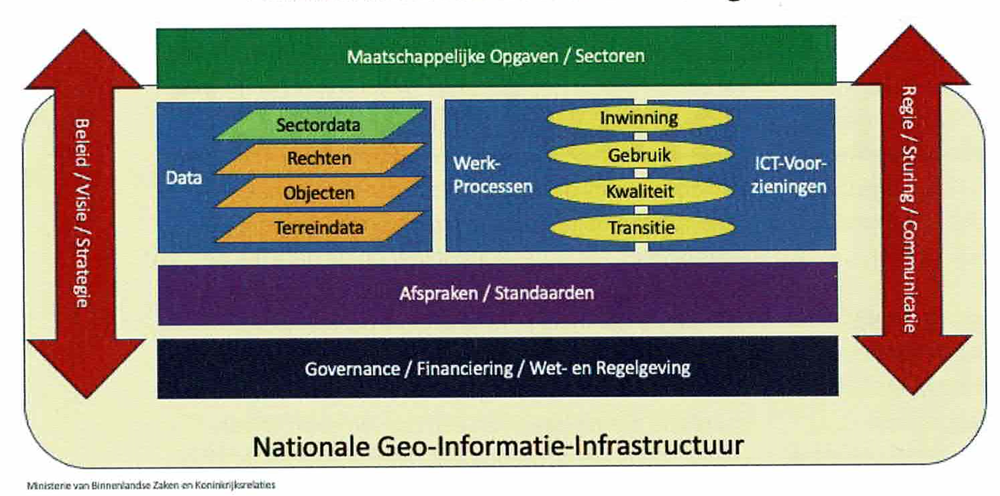
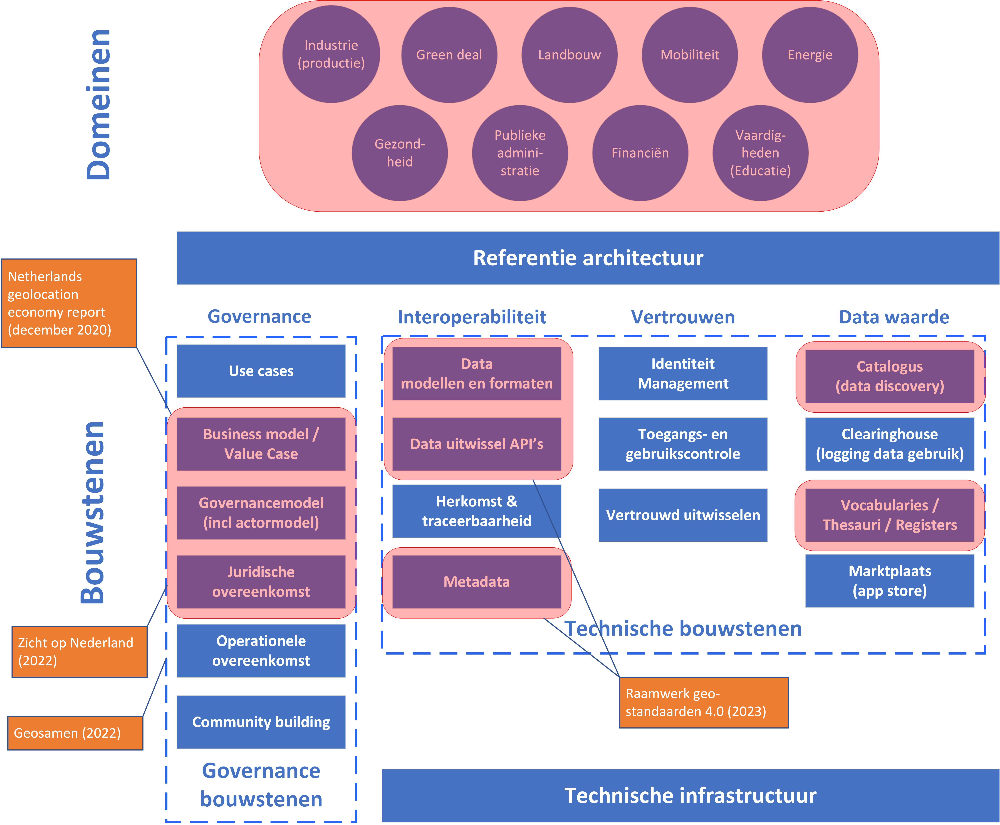
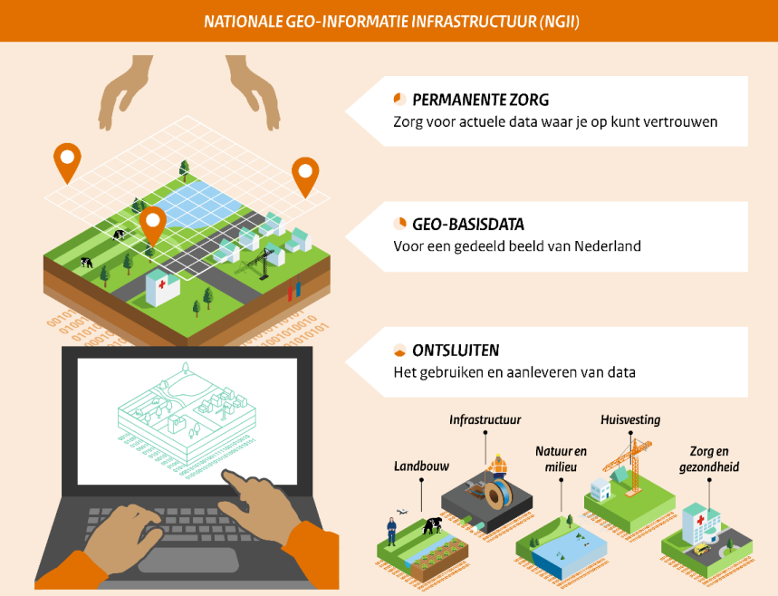

# De Nationale geo-informatie infrastructuur {#2E0DC280}

<b>Dit hoofdstuk introduceert de Nationale Geo-Informatie Infrastructuur (NGII) als ‘data space’. We belichten het ‘data fundament’, de afspraken over standaarden voor interoperabiliteit, de bouwstenen en voorzieningen in de nationale geo-informatie infrastructuur. </b> 
## De nationale geo-informatie infrastructuur {#43B80F03}

De geo-informatie infrastructuur is eigenlijk een internationaal concept, dat in de loop van de jaren invulling heeft gekregen in Nederland via wetgeving, afspraken en governance, standaardisatie en implementatie van centrale en decentrale voorzieningen en data platforms in vooral publieke organisaties. 

Het ministerie van Binnenlandse zaken, verantwoordelijk voor de nationale geo-informatie infrastructuur, ziet de NGII als een datafundament onder de maatschappelijke opgaven, en sectoren die er gebruik van maken [[GeoInfo]]. De NGII bestaat allereerst uit de dingen, die het moeten doen: dataverzamelingen, voorzieningen en de werkprocessen om deze op orde te houden (blauwe blokken in de figuur 8.1). Daaronder de zaken die voorwaardenscheppend zijn: afspraken en standaarden om tot een samenhangend geheel te komen, governance om de gezamenlijke afspraken ook te kunnen maken, financiering om realisatie, beheer en onderhoud mogelijk te maken, en wet- en regelgeving om de hoofdlijnen vast te leggen op een manier die partijen bindt. In de pijl links het verbindende beleid, visie strategie en rechts de regie, sturing en communicatie op het geheel.

</img>
<i>Figuur 8.1 – Nationale geo-informatie infrastructuur </i><b><i>[[Geo-Info]]</i></b>

De Nationale Geo-informatie Infrastructuur (NGII) omvat de <a href='https://www.geobasisregistraties.nl/' target='_blank'>geo-basisregistraties</a>, voorzieningen als <a href='https://www.pdok.nl/' target='_blank'>PDOK</a>, en afspraken en standaarden, die in een aantal gevallen wettelijk geregeld zijn. Een aantal registraties die niet de status van basisregistratie hebben maar wel breed worden gebruikt, zouden hier ook toe gerekend kunnen worden. Daarvoor is onlangs een beleidsvisie opgesteld om te komen tot een nationaal geo-datafundament (zie verder paragraaf 8.3). Gebruikers participeren actief in het richting geven aan de basisregistraties en voorzieningen, dragen bij in de financiering, en leveren ook vaak een inhoudelijke bijdrage, bijvoorbeeld in de rol van data eigenaar en data provider door het doen van terugmeldingen aan de basisregistraties.

De NGII als publieke infrastructuur wordt bestuurd vanuit het Ministerie van Binnenlandse zaken en Koninkrijksrelaties. De huidige minister van Volkshuisvesting en Woningbouw is verantwoordelijk voor de geo-informatie en het geo-informatie beleid. Het GI-Beraad, waarin alle publieke partijen zijn vertegenwoordigd (diverse rijksoverheden, provinciale en lokale overheden), is het belangrijkste adviesorgaan voor de verantwoordelijk minister. Het beleid van de NGII is vastgelegd in <a href='https://www.geosamen.nl/' target='_blank'>Geosamen</a>, een gezamenlijk initiatief van overheid, bedrijfsleven en onderzoeks- en onderwijsinstellingen. De bedrijven zijn vertegenwoordigd via branchevereniging <a href='https://www.geobusiness.nl/' target='_blank'>Geobusiness NL</a> en de onderzoeks- en onderwijsinstellingen door het <a href='https://ncgeo.nl/index.php/nl/' target='_blank'>Nederlands Centrum voor Geodesie en Geo-Informatica</a> (het NCG).

De NGII is mede tot stand gekomen via wet- en regelgeving. Geo-informatie is op verschillende wijze in wetgeving verankerd, zowel internationale (bijvoorbeeld INSPIRE en diverse sectorale wetten) als nationale wet- en regelgeving (m.n. basisregistraties).  
Dat heeft er mede toe geleid, dat in2009het <a href='https://www.nationaalgeoregister.nl/' target='_blank'>nationaal georegister</a> is opgezet, waarin inmiddels meer dan 8000 datasets van diverse rijksoverheden, de provincies, waterschappen en diverse gemeenten zijn geregistreerd om de toegang tot publieke geo-informatie te verbeteren. Daarbij zorgen diverse datavoorzieningen, zoals <a href='http://www.pdok.nl' target='_blank'>PDOK</a> bij het Kadaster en het <a href='https://www.satellietdataportaal.nl/?base=brtachtergrondkaart&res=0.5&datemin=03-11-2021' target='_blank'>satellietdata portaal</a> van het Netherlands Space Office (NSO) voor de toegang tot de data.  

De standaardisatie van geo-informatie in de publieke sector is belegd en toegekend aan een onafhankelijke kennisinstelling (<a href='http://www.geonovum.nl' target='_blank'>Stichting Geonovum</a>) en voor de specifieke Nederlandse geodetische infrastructuur bij de <a href='https://nsgi.nl/' target='_blank'>Nederlandse Samenwerking Geodetische Infrastructuur (NSGI)</a>. De aandacht voor het juiste gebruik van coördinaatreferentiesystemen in geo-informatie(systemen) is belegd bij het Kadaster (als beheerder van Rijksdriehoeksmeting), Rijkswaterstaat (als beheerder van Normaal Amsterdams Peil) en de Hydrografische Dienst (primair gericht op het mariene deel van Nederland).  
## Synthese {#49D0E032}

In de afgelopen 15 jaar is de nationale geo-informatie infrastructuur als ecosysteem van vele partijen ontstaan en heeft geleid tot afspraken over allerlei aspecten over het delen van geo-informatie: de geo-basisregistraties, met API’s voor ontsluiting, catalogi voor vindbaarheid en standaarden voor interoperabiliteit, al dan niet vastgelegd in wetgeving. Ook governance is ingericht. In figuur 8.2 zijn de verschillende beschouwingsgebieden van de NGII als data space initiatief weergegeven.

De NGII heeft een cross-domein perspectief, zonder binding aan een bepaald toepassingsdomein maar aan diverse domeinen, waarin de geografische data over actoren, objecten, activiteiten en systemen in de werkelijkheid of fysieke leefomgeving een rol spelen. De werking en toepassing van de NGII zijn terug te zien in de uiteenlopende toepassingsdomeinen, zoals beheer en onderhoud van infrastructuur, watermanagement, mobiliteit, natuurbescherming, energietransitie, industrie, ruimtelijke ordening, woningbouw, landbouw, publieke administratie (bijv. belastingheffing). 

Een eenduidige beschrijving van de NGII is eigenlijk niet beschikbaar. De NGII heeft bijvoorbeeld geen uniforme referentie architectuur, waarin de samenhang van de onderliggende bouwstenen is beschreven.

</img>
<i>Figuur 8.2 - Focusgebieden NGII als data space initiatief</i>

In 2020 heeft de NGII een ‘businessmodel’ gekregen met het rapport ‘Netherlands geolocation economy report’ [[BZK-GeoL]]. Dit rapport geeft inzicht in de Nederlandse geo-data-economie en de impact die deze data heeft op de economie.  
Het rapport geeft een kort overzicht van enige geo-data technologieën en de voordelen van gebruik. Dit wordt gevolgd met een analyse, die de ‘geospatial readiness’ van Nederland ten opzichte van andere landen weergeeft. Hierbij scoort Nederland 4de in 2019. In 2022 verscheen een update van de internationale ‘geospatial knowlegde infrastructure readiness’ index en bleek Nederland de vierde positie te behouden na USA, het Verenigd Koninkrijk en Denemarken [[GW]]. 

Juridische overeenkomsten, die een rol spelen in de NGII zijn wet- en regelgevend en van toepassing op data delen, zoals de wetten voor de basisregistraties, de INSPIRE wet en de Wet Open Overheid (hergebruik van data). Conform deze wetgeving zijn uiteenlopende verplichtingen voor de overheden om data te delen en toegankelijk te maken. Onder de NGII an zich ligt geen juridische grondslag. Verschillende wetgevingen geven de NGII een juridische betekenis. 

De interoperabiliteit van de NGII is geregeld via diverse afspraken. Het gaat om zowel standaarden voor data (informatiemodellen en formats), toegang tot data via API’s, als ook voor het vinden van data via metadata en coördinaatreferentiesystemen. Standaarden voor herkomst en traceerbaarheid zijn niet specifiek gemaakt. De standaardisatie van de NGII is verder geregeld via afspraken, zoals:  
<ul><li>Standaarden voor de publieke sector worden aangeboden in het Forum standaardisatie (pas-toe-leg-uit lijst);</li>
<li>De ontwikkeling en het beheer van de geo-standaarden is de stichting Geonovum aangewezen, in nauwe afstemming met standaardisatie-organisaties, zoals OGC, ISO (TC211), W3C en de NEN (via de werkgroep NEN3610); </li>
<li>Het Raamwerk van geo-standaarden benoemt de vigerende geo-standaarden voor data (informatiemodellen), metadata, API’s, uitwisselformaten, visualisaties en coördinaatreferentiesystemen. </li>
</ul>

Vanuit het oogpunt van ‘data waarde’ heeft de NGII twee aspecten duidelijk uitgewerkt en geïmplementeerd in Nederland: metadata catalogi is een algemeen geaccepteerde voorziening bij publieke organisaties om geo-informatie vindbaar te maken voor (her)gebruik. Nationaal heeft dat geleid tot <a href='https://www.nationaalgeoregister.nl/' target='_blank'>een nationaal georegister</a>, waarin circa 8000 datasets te vinden zijn van diverse uiteenlopende publieke organisaties. Het nationaal georegister is verbonden met het open data portaal van de overheid, eveneens met het Europese geoportaal. De NGII kent diverse vocabulaires, thesauri en registers, zoals <a href='https://definities.geostandaarden.nl/nl/' target='_blank'>de conceptenbibliotheek voor informatiemodellen</a>, <a href='https://register.geostandaarden.nl/' target='_blank'>technisch register voor geo-standaarden</a> en <a href='https://www.inspireaanmerking.nl/' target='_blank'>een aanmerkingsregister voor organisaties met INSPIRE datasets</a>. Een clearinghouse voor het loggen van transacties of een app store (marktplaats) kent de NGII niet. Wel heeft de NGII diverse voorzieningen, die de ontsluiting van geografische datasets via API’s verzorgen, waaronder het eerder genoemde <a href='https://www.pdok.nl/' target='_blank'>PDOK</a> en het <a href='https://www.satellietdataportaal.nl/?base=brtachtergrondkaart&res=0.5&datemin=03-11-2021' target='_blank'>satellietdata portaal</a>. 

In de NGII zijn geen of nauwelijks specifieke afspraken opgenomen voor het vertrouwd delen van data. Een specifiek vertrouwenskader ontbreekt. Vanuit het sterk publieke karakter van de NGII wordt voor de invulling van het vertrouwenskader geleund op de generieke afspraken in de publieke sector. Het publieke ‘open data’ beleid is hierbij richtinggevend geweest, waardoor een vertrouwensraamwerk niet van de grond is gekomen of niet nodig is geweest, zoals het inrichten van identiteit management en toegangs- en gebruikscontrole op basis van uiteenlopende ‘policies’. 

De NGII is vooralsnog een publieke data space. Dat neemt niet weg dat vertrouwd delen van locatie gebonden data ook in specifieke use cases aan de orde is . In de praktijk worden daarvoor ‘datadeals’ gesloten ([[Geonovum]]). Zo hebben de Waterschappen een deal gesloten met een bedrijf dat satellietdata inzamelt om die data als open data beschikbaar te maken. En de VNG werkt aan leveringsafspraken met KvK, woningbouwcorporaties en met energiebedrijven om hun data herbruikbaar te maken door gemeenten. Voor het delen van data van derden m.n. niet-overheden kan een data space met een vertrouwenskader een oplossing zijn .  
## Van NGII naar geo-datafundament? {#31DD07C2}

In de recent gepubliceerd beleidsvisie “Zicht op Nederland” wordt de transitie van de NGII naar het geo-datafundament voor de leefomgeving voorzien om grip te krijgen op de grote maatschappelijk opgaven in Nederland. De NGII en de daarin gelegen databronnen, afspraken en standaarden en voorzieningen vormen het data fundament waar de publieke partijen hun benodigde informatie op kunnen bouwen. Het biedt niet alleen een hoogwaardig, betrouwbaar en gedeeld beeld van de leefomgeving. Het functioneert ook als referentiepunt waar andere data mee kan worden verbonden, wat van cruciaal belang is voor het bredere datastelstel – zowel sectoraal, nationaal als Europees. ” In “Zicht op Nederland” [[BZK-ZoNL]] wordt geconstateerd dat de NGII is ontstaan in de afgelopen 20 jaar door de meest relevante basisdata ten behoeve van overheid breed gebruik. Belangrijke kern daarvan vormen de zes basisregistraties, die de meest gebruikte data uit de fysieke leefomgeving bevatten. Tezamen met diverse andere relevante data, standaarden, afspraken en voorzieningen vormen ze de NGII, dat het datafundament biedt waarop overheidsorganisaties hun beleid, besluitvorming en uitvoeringstaken baseren (zie figuur 8.3). 

</img>
<i>Figuur 8.3 – De NGII gevisualiseerd </i><b><i>[[BZK-ZoNL]]</i></b>

De NGII wordt niet alleen gezien als verbinder tussen sectoren, maar ook als verbinder in de Nederlandse data-federatie. In hoofdstuk 7 is een beeld geschetst van een Nederlands federatief datastelsel (de NL data-federatie) waarin locatie wordt beschouwd als één van de belangrijke sleutels voor het verbinden van data. Maar ook wordt in “Zicht op Nederland” geconstateerd dat de NGII ook een rol gaat spelen in de Europese arena van data spaces. “In veel van de door de Europese datastrategie beoogde dataruimten vormt de geo-informatie uit de NGII een essentieel element. Zo kennen de dataruimte green deal en dataruimten voor mobiliteitsdata, energiedata en landbouwdata een sterke afhankelijkheid van goede geodata” [[BZK-ZoNL]]. Deze visie leidt ook tot een concept’ van de samenhangende data’, een transitie om een integraal en rijk databeeld van de leefomgeving in 2D en 3D te creëren met mogelijkheden voor koppelbaarheid en flexibele uitbreidingsmogelijkheden. Dat wordt in gang gezet door een zestal datalagen te harmoniseren, standaardiseren en in samenhang te ontsluiten (zie figuur 8.4). Tot slot is in “Zicht op Nederland” ook de organisatie op orde gebracht; financiering, wet en regelgeving (“Wet geodata”) en samenwerking en governance met alle betrokken partijen om (de NGII en) het toekomstig data fundament, dat wordt omschreven als het verrijkte geheel aan samenhangende geodata uit zowel de basisregistraties als sectordata, tot stand te brengen. 
</img>
<i>Figuur 8.4 – De zes datalagen van de NGII gevisualiseerd [[BZK-ZoNL]]</i>

